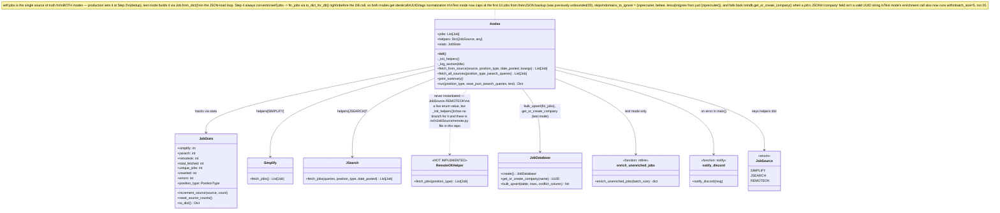

```mermaid
%% classDiagram — Azalea structure and relationships
classDiagram
    class Azalea {
        +jobs: List[Job]
        +helpers: Dict[JobSource, any]
        +stats: JobStats
        +__init__()
        -_init_helpers()
        -_log_section(title)
        +fetch_from_source(source, position_type, date_posted, kwargs) List[Job]
        +fetch_all_sources(position_type, jsearch_queries) List[Job]
        +print_summary()
        +run(position_type, save_json, jsearch_queries, test) Dict
    }

    class JobStats {
        +simplify: int
        +jsearch: int
        +remoteok: int
        +total_fetched: int
        +unique_jobs: int
        +inserted: int
        +errors: int
        +position_type: PositionType
        +increment_source(source, count)
        +reset_source_counts()
        +to_dict() Dict
    }

    class Simplify {
        +fetch_jobs() List[Job]
    }

    class JSearch {
        +fetch_jobs(queries, position_type, date_posted) List[Job]
    }

    class RemoteOKHelper {
        <<NOT IMPLEMENTED>>
        +fetch_jobs(position_type) List[Job]
    }

    class JobDatabase {
        +create() JobDatabase
        +get_or_create_company(name) UUID
        +bulk_upsert(table, rows, conflict_column) list
    }

    class enrich_unenriched_jobs {
        <<function: refine>>
        +enrich_unenriched_jobs(batch_size) dict
    }

    class notify_discord {
        <<function: notify>>
        +notify_discord(msg)
    }

    class JobSource {
        <<enum>>
        SIMPLIFY
        JSEARCH
        REMOTEOK
    }

    Azalea --> JobStats : tracks via stats
    Azalea --> Simplify : helpers[SIMPLIFY]
    Azalea --> JSearch : helpers[JSEARCH]?
    Azalea ..> RemoteOKHelper : never instantiated — JobSource.REMOTEOK\nis a live enum value, but _init_helpers()\nhas no branch for it and there is no\nJobSource/remote.py file in this repo
    Azalea --> JobDatabase : bulk_upsert(fin_jobs), get_or_create_company (test mode)
    Azalea --> enrich_unenriched_jobs : test mode only
    Azalea --> notify_discord : on error in main()
    Azalea --> JobSource : keys helpers dict

    note for Azalea "self.jobs is the single source of truth for\nBOTH modes — production sets it at Step 2\n(dedup), test mode builds it via Job.from_dict()\nin the JSON-load loop. Step 4 always converts\nself.jobs -> fin_jobs via to_dict_for_db() right\nbefore the DB call, so both modes get identical\nUUID/tags normalization.\n\nTest mode now caps at the first 10 jobs from the\nJSON backup (was previously unbounded/20), skips\ndomains_to_ignore = {ziprecruiter, bebee, lensa}\n(grew from just {ziprecruiter}), and falls back to\ndb.get_or_create_company() when a job's JSON\n'company' field isn't a valid UUID string.\nTest mode's enrichment call also now runs with\nbatch_size=5, not 20."
```