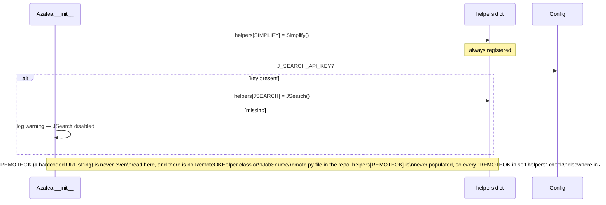
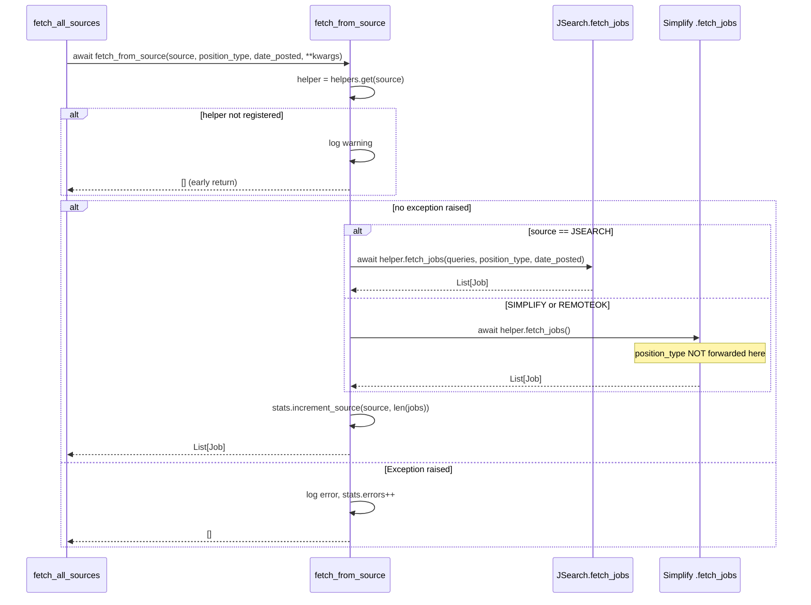
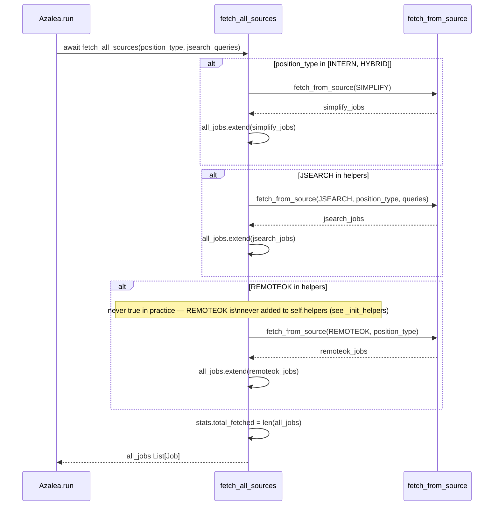
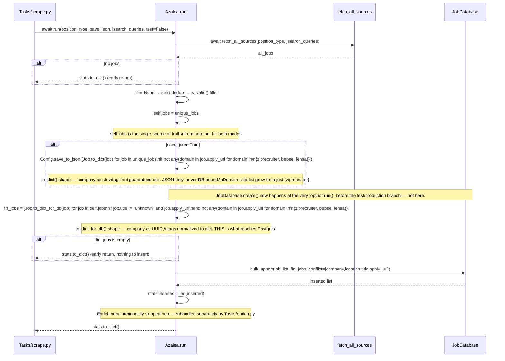
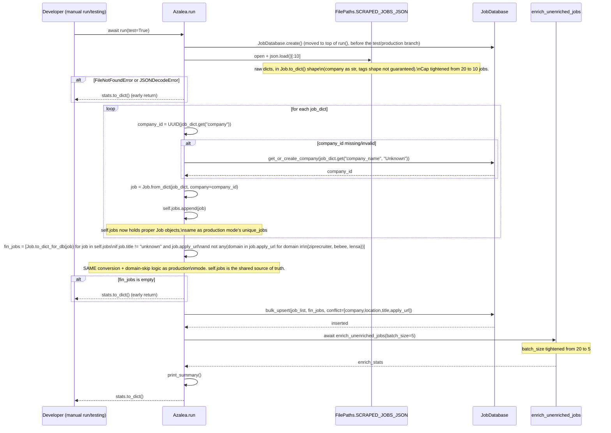

```mermaid
%% sequenceDiagram — _init_helpers (conditional source registration)
sequenceDiagram
    participant Az as Azalea.__init__
    participant H as helpers dict
    participant Cfg as Config

    Az->>H: helpers[SIMPLIFY] = Simplify()
    Note over H: always registered

    Az->>Cfg: J_SEARCH_API_KEY?
    alt key present
        Az->>H: helpers[JSEARCH] = JSearch()
    else missing
        Az->>Az: log warning — JSearch disabled
    end

    Note over Az,H: _init_helpers() has NO branch for JobSource.REMOTEOK at\nall — Config.REMOTEOK (a hardcoded URL string) is never even\nread here, and there is no RemoteOKHelper class or\nJobSource/remote.py file in the repo. helpers[REMOTEOK] is\nnever populated, so every "REMOTEOK in self.helpers" check\nelsewhere in Azalea is always False and that source is dead code.

```

```mermaid
%% sequenceDiagram — fetch_from_source (route to correct helper)
%% NOTE: position_type is forwarded to JSearch only. For SIMPLIFY (the only other
%% helper actually registered) the case _ branch calls helper.fetch_jobs() with no
%% args, dropping position_type. REMOTEOK is included for completeness but never
%% reaches this point in practice — see _init_helpers diagram above.
sequenceDiagram
    participant FA as fetch_all_sources
    participant Az as fetch_from_source
    participant JS as JSearch.fetch_jobs
    participant Other as Simplify .fetch_jobs

    FA->>Az: await fetch_from_source(source, position_type, date_posted, **kwargs)
    Az->>Az: helper = helpers.get(source)

    alt helper not registered
        Az->>Az: log warning
        Az-->>FA: [] (early return)
    end

    alt no exception raised
        alt source == JSEARCH
            Az->>JS: await helper.fetch_jobs(queries, position_type, date_posted)
            JS-->>Az: List[Job]
        else SIMPLIFY or REMOTEOK
            Az->>Other: await helper.fetch_jobs()
            Note over Other: position_type NOT forwarded here
            Other-->>Az: List[Job]
        end
        Az->>Az: stats.increment_source(source, len(jobs))
        Az-->>FA: List[Job]
    else Exception raised
        Az->>Az: log error, stats.errors++
        Az-->>FA: []
    end

```

```mermaid
%% sequenceDiagram — fetch_all_sources (per-source gating by position type)
sequenceDiagram
    participant Run as Azalea.run
    participant FA as fetch_all_sources
    participant FFS as fetch_from_source

    Run->>FA: await fetch_all_sources(position_type, jsearch_queries)

    alt position_type in [INTERN, HYBRID]
        FA->>FFS: fetch_from_source(SIMPLIFY)
        FFS-->>FA: simplify_jobs
        FA->>FA: all_jobs.extend(simplify_jobs)
    end

    alt JSEARCH in helpers
        FA->>FFS: fetch_from_source(JSEARCH, position_type, queries)
        FFS-->>FA: jsearch_jobs
        FA->>FA: all_jobs.extend(jsearch_jobs)
    end

    alt REMOTEOK in helpers
        Note over FA: never true in practice — REMOTEOK is\nnever added to self.helpers (see _init_helpers)
        FA->>FFS: fetch_from_source(REMOTEOK, position_type)
        FFS-->>FA: remoteok_jobs
        FA->>FA: all_jobs.extend(remoteok_jobs)
    end

    FA->>FA: stats.total_fetched = len(all_jobs)
    FA-->>Run: all_jobs List[Job]

```

```mermaid
%% sequenceDiagram — run() PRODUCTION mode (test=False): fetch → dedup → JSON → DB
%% This is the actual, intended behavior of run() when called normally
%% (e.g. from Tasks/scrape.py). Enrichment does NOT happen here by design —
%% see Tasks/enrich.py / the separate GitHub Actions "enrich" job instead.
sequenceDiagram
    participant Entry as Tasks/scrape.py
    participant Az as Azalea.run
    participant FA as fetch_all_sources
    participant DB as JobDatabase

    Entry->>Az: await run(position_type, save_json, jsearch_queries, test=False)

    Az->>FA: await fetch_all_sources(position_type, jsearch_queries)
    FA-->>Az: all_jobs

    alt no jobs
        Az-->>Entry: stats.to_dict() (early return)
    end

    Az->>Az: filter None → set() dedup → is_valid() filter
    Az->>Az: self.jobs = unique_jobs
    Note over Az: self.jobs is the single source of truth\nfrom here on, for both modes

    alt save_json=True
        Az->>Az: Config.save_to_json([Job.to_dict(job) for job in unique_jobs\nif not any(domain in job.apply_url for domain in\n{ziprecruiter, bebee, lensa})])
        Note over Az: to_dict() shape — company as str,\ntags not guaranteed dict. JSON-only, never DB-bound.\nDomain skip-list grew from just {ziprecruiter}.
    end

    Note over Az,DB: JobDatabase.create() now happens at the very top\nof run(), before the test/production branch — not here.
    Az->>Az: fin_jobs = [Job.to_dict_for_db(job) for job in self.jobs\nif job.title != "unknown" and job.apply_url\nand not any(domain in job.apply_url for domain in\n{ziprecruiter, bebee, lensa})]
    Note over Az: to_dict_for_db() shape — company as UUID,\ntags normalized to dict. THIS is what reaches Postgres.

    alt fin_jobs is empty
        Az-->>Entry: stats.to_dict() (early return, nothing to insert)
    end

    Az->>DB: bulk_upsert(job_list, fin_jobs, conflict=[company,location,title,apply_url])
    DB-->>Az: inserted list
    Az->>Az: stats.inserted = len(inserted)

    Note over Az: Enrichment intentionally skipped here —\nhandled separately by Tasks/enrich.py

    Az-->>Entry: stats.to_dict()

```

```mermaid
%% sequenceDiagram — run() TEST mode (test=True): JSON load → self.jobs → DB → enrich
%% Used for iterating on enrichment logic without re-hitting scrape sources.
%% FIXED: previously this path inserted raw, unconverted JSON dicts (missing
%% UUID/tags normalization) instead of going through to_dict_for_db() like
%% production mode did. Both modes now share the same fin_jobs conversion step.
sequenceDiagram
    participant Dev as Developer (manual run/testing)
    participant Az as Azalea.run
    participant FS as FilePaths.SCRAPED_JOBS_JSON
    participant DB as JobDatabase
    participant Enrich as enrich_unenriched_jobs

    Dev->>Az: await run(test=True)
    Az->>DB: JobDatabase.create()  (moved to top of run(), before the test/production branch)

    Az->>FS: open + json.load()[:10]
    Note over FS: raw dicts, in Job.to_dict() shape\n(company as str, tags shape not guaranteed).\nCap tightened from 20 to 10 jobs.

    alt FileNotFoundError or JSONDecodeError
        Az-->>Dev: stats.to_dict() (early return)
    end

    loop for each job_dict
        Az->>Az: company_id = UUID(job_dict.get("company"))
        alt company_id missing/invalid
            Az->>DB: get_or_create_company(job_dict.get("company_name", "Unknown"))
            DB-->>Az: company_id
        end
        Az->>Az: job = Job.from_dict(job_dict, company=company_id)
        Az->>Az: self.jobs.append(job)
        Note over Az: self.jobs now holds proper Job objects,\nsame as production mode's unique_jobs
    end

    Az->>Az: fin_jobs = [Job.to_dict_for_db(job) for job in self.jobs\nif job.title != "unknown" and job.apply_url\nand not any(domain in job.apply_url for domain in\n{ziprecruiter, bebee, lensa})]
    Note over Az: SAME conversion + domain-skip logic as production\nmode. self.jobs is the shared source of truth.

    alt fin_jobs is empty
        Az-->>Dev: stats.to_dict() (early return)
    end

    Az->>DB: bulk_upsert(job_list, fin_jobs, conflict=[company,location,title,apply_url])
    DB-->>Az: inserted

    Az->>Enrich: await enrich_unenriched_jobs(batch_size=5)
    Note over Enrich: batch_size tightened from 20 to 5
    Enrich-->>Az: enrich_stats

    Az->>Az: print_summary()
    Az-->>Dev: stats.to_dict()

```