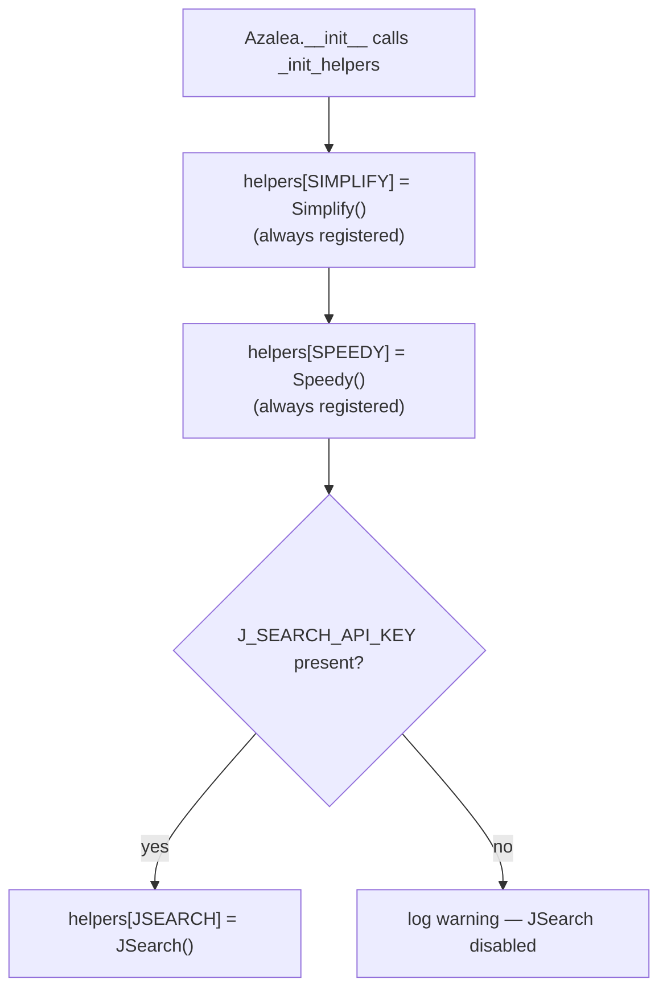
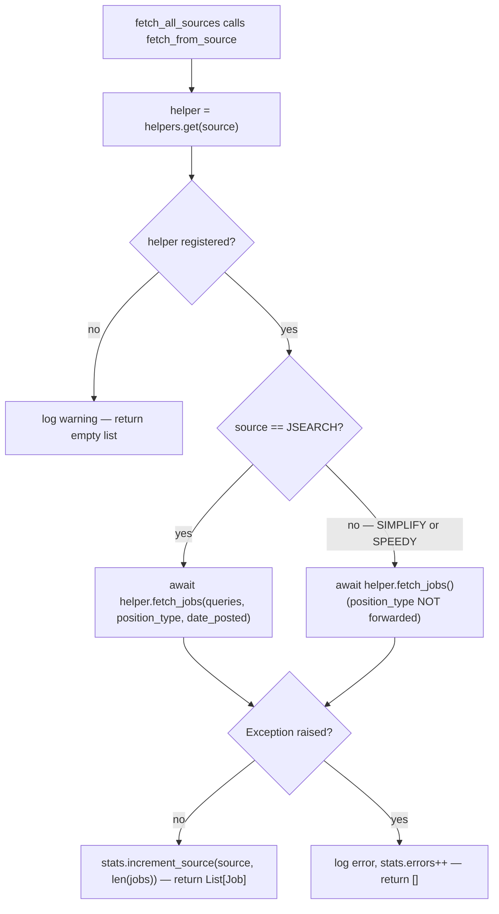
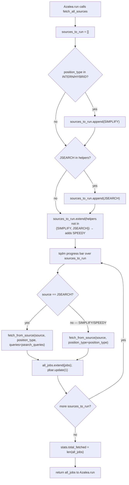
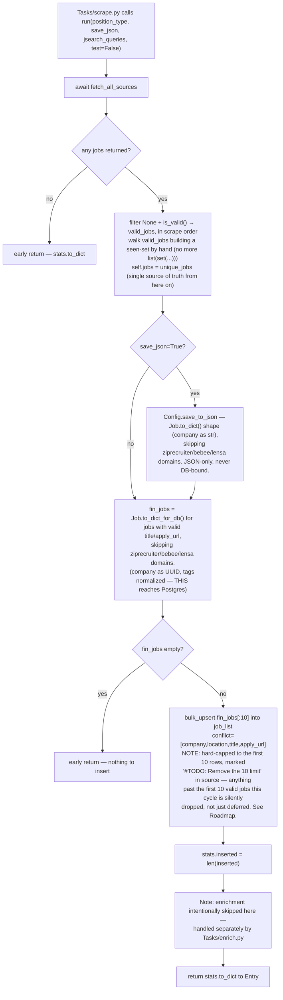
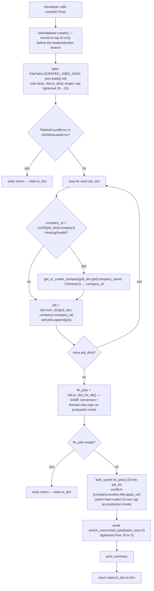

```mermaid
%% flowchart — _init_helpers (source registration)
%% NOTE: position_type is forwarded to JSearch only — see fetch_from_source below.
flowchart TD
    A[Azalea.__init__ calls _init_helpers] --> B["helpers[SIMPLIFY] = Simplify()<br/>(always registered)"]
    B --> C["helpers[SPEEDY] = Speedy()<br/>(always registered)"]
    C --> D{J_SEARCH_API_KEY present?}
    D -->|yes| E["helpers[JSEARCH] = JSearch()"]
    D -->|no| F[log warning — JSearch disabled]
```

```mermaid
%% flowchart — fetch_from_source (route to correct helper)
%% NOTE: position_type is forwarded to JSearch only. For SIMPLIFY/SPEEDY the
%% case _ branch calls helper.fetch_jobs() with no args, dropping position_type.
flowchart TD
    A[fetch_all_sources calls fetch_from_source] --> B["helper = helpers.get(source)"]
    B --> C{helper registered?}
    C -->|no| D[log warning — return empty list]
    C -->|yes| E{"source == JSEARCH?"}
    E -->|yes| F["await helper.fetch_jobs(queries, position_type, date_posted)"]
    E -->|no — SIMPLIFY or SPEEDY| G["await helper.fetch_jobs()<br/>(position_type NOT forwarded)"]
    F --> H{Exception raised?}
    G --> H
    H -->|no| I["stats.increment_source(source, len(jobs)) — return List[Job]"]
    H -->|yes| J["log error, stats.errors++ — return []"]
```

```mermaid
%% flowchart — fetch_all_sources (builds an ordered source list, then runs it under a tqdm bar)
flowchart TD
    A[Azalea.run calls fetch_all_sources] --> B["sources_to_run = []"]
    B --> C{position_type in INTERN/HYBRID?}
    C -->|yes| D["sources_to_run.append(SIMPLIFY)"]
    C -->|no| E{JSEARCH in helpers?}
    D --> E
    E -->|yes| F["sources_to_run.append(JSEARCH)"]
    E -->|no| G["sources_to_run.extend(helpers not in\n{SIMPLIFY, JSEARCH}) → adds SPEEDY"]
    F --> G
    G --> H["tqdm progress bar over sources_to_run"]
    H --> I{"source == JSEARCH?"}
    I -->|yes| J["fetch_from_source(source, position_type, queries=jsearch_queries)"]
    I -->|no — SIMPLIFY/SPEEDY| K["fetch_from_source(source, position_type=position_type)"]
    J --> L["all_jobs.extend(jobs); pbar.update(1)"]
    K --> L
    L --> M{more sources_to_run?}
    M -->|yes| H
    M -->|no| N["stats.total_fetched = len(all_jobs)"]
    N --> O[return all_jobs to Azalea.run]
```

```mermaid
%% flowchart — run() PRODUCTION mode (test=False): fetch → dedup → JSON → DB
%% Enrichment does NOT happen here by design — see Tasks/enrich.py /
%% the separate GitHub Actions "enrich" job instead.
flowchart TD
    A["Tasks/scrape.py calls run(position_type, save_json, jsearch_queries, test=False)"] --> B[await fetch_all_sources]
    B --> C{any jobs returned?}
    C -->|no| Z1[early return — stats.to_dict]
    C -->|yes| D["filter None + is_valid() → valid_jobs, in scrape order<br/>walk valid_jobs building a seen-set by hand (no more list(set(...)))<br/>self.jobs = unique_jobs (single source of truth from here on)"]
    D --> E{save_json=True?}
    E -->|yes| F["Config.save_to_json — Job.to_dict() shape (company as str),<br/>skipping ziprecruiter/bebee/lensa domains. JSON-only, never DB-bound."]
    E -->|no| G["fin_jobs = Job.to_dict_for_db() for jobs with valid title/apply_url,<br/>skipping ziprecruiter/bebee/lensa domains.<br/>(company as UUID, tags normalized — THIS reaches Postgres)"]
    F --> G
    G --> H{fin_jobs empty?}
    H -->|yes| Z2[early return — nothing to insert]
    H -->|no| I["bulk_upsert fin_jobs[:10] into job_list<br/>conflict=[company,location,title,apply_url]<br/>NOTE: hard-capped to the first 10 rows, marked\n'#TODO: Remove the 10 limit' in source — anything\npast the first 10 valid jobs this cycle is silently\ndropped, not just deferred. See Roadmap."]
    I --> J["stats.inserted = len(inserted)"]
    J --> K["Note: enrichment intentionally skipped here —<br/>handled separately by Tasks/enrich.py"]
    K --> L[return stats.to_dict to Entry]
```

```mermaid
%% flowchart — run() TEST mode (test=True): JSON load → self.jobs → DB → enrich
%% Used for iterating on enrichment logic without re-hitting scrape sources.
%% Both modes share the same fin_jobs conversion step (to_dict_for_db).
flowchart TD
    A["Developer calls run(test=True)"] --> B["JobDatabase.create() — moved to top of run(),<br/>before the test/production branch"]
    B --> C["open FilePaths.SCRAPED_JOBS_JSON, json.load()[:10]<br/>(raw dicts, Job.to_dict() shape; cap tightened 20→10)"]
    C --> D{FileNotFoundError or JSONDecodeError?}
    D -->|yes| Z1[early return — stats.to_dict]
    D -->|no| E[loop for each job_dict]
    E --> F{"company_id = UUID(job_dict['company'])<br/>missing/invalid?"}
    F -->|yes| G["get_or_create_company(job_dict.get('company_name', 'Unknown')) → company_id"]
    F -->|no| H["job = Job.from_dict(job_dict, company=company_id)<br/>self.jobs.append(job)"]
    G --> H
    H --> I{more job_dicts?}
    I -->|yes| E
    I -->|no| J["fin_jobs = Job.to_dict_for_db() — SAME conversion +<br/>domain-skip logic as production mode"]
    J --> K{fin_jobs empty?}
    K -->|yes| Z2[early return — stats.to_dict]
    K -->|no| L["bulk_upsert fin_jobs[:10] into job_list<br/>conflict=[company,location,title,apply_url]<br/>(same hard-coded 10-row cap as production mode)"]
    L --> M["await enrich_unenriched_jobs(batch_size=5)<br/>(tightened from 20 to 5)"]
    M --> N[print_summary]
    N --> O[return stats.to_dict to Dev]
```
