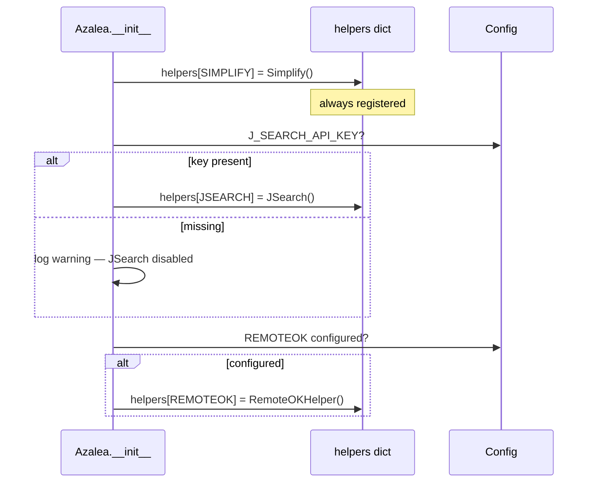
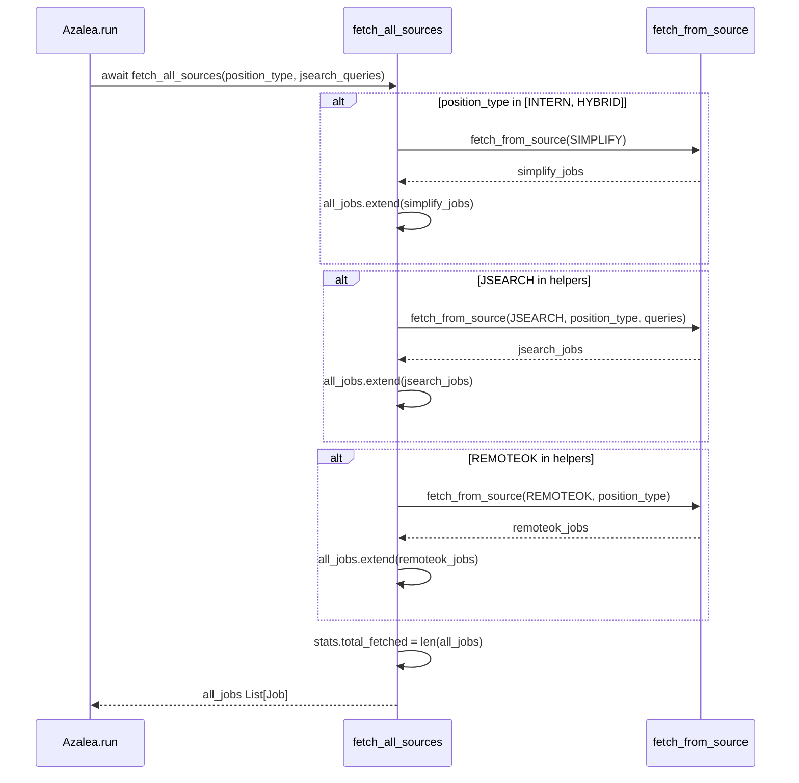
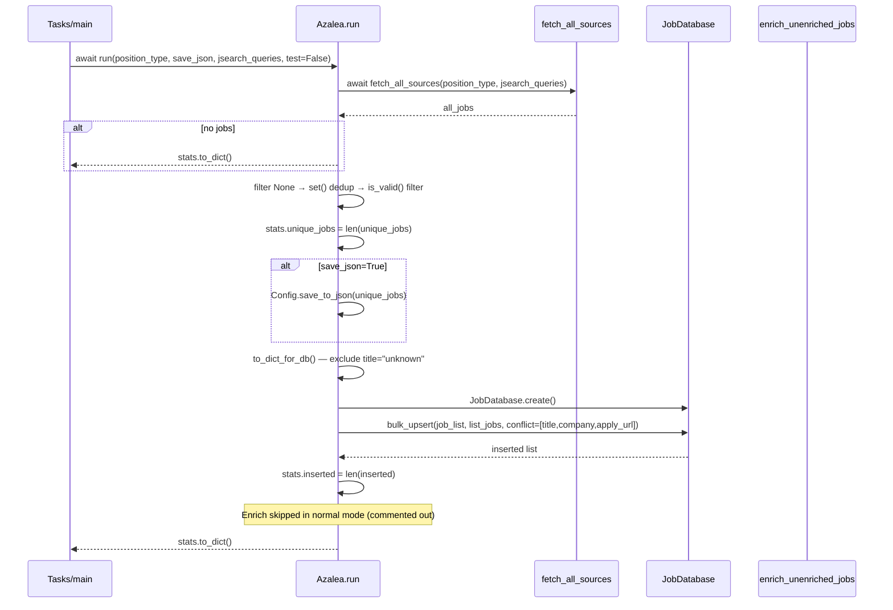
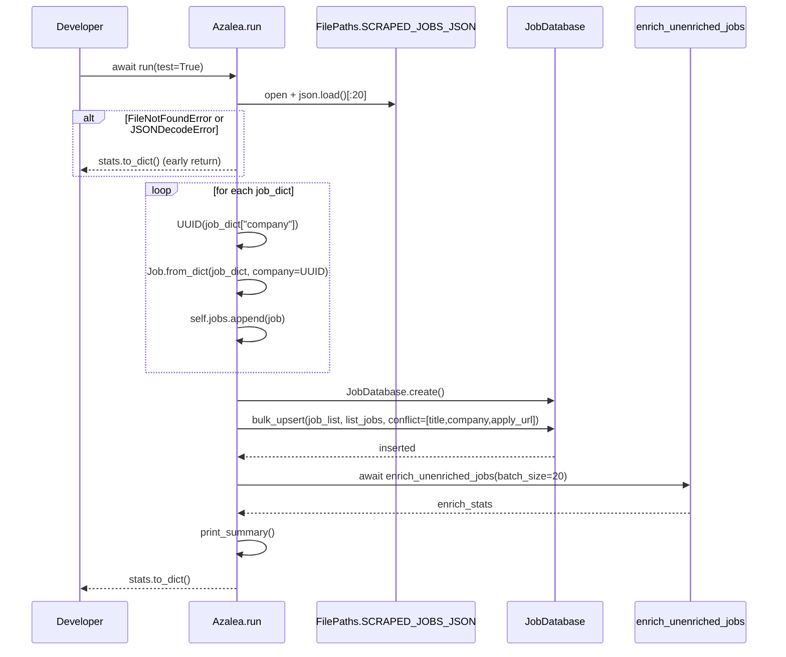

```mermaid
%% sequenceDiagram — fetch_from_source (route to correct helper)
%% NOTE: position_type is forwarded to JSearch only. For SIMPLIFY and REMOTEOK
%% the case _ branch calls helper.fetch_jobs() with no args, dropping position_type.
sequenceDiagram
    participant FA as fetch_all_sources
    participant Az as fetch_from_source
    participant JS as JSearch.fetch_jobs
    participant Other as Simplify / RemoteOK .fetch_jobs

    FA->>Az: await fetch_from_source(source, position_type, date_posted, **kwargs)
    Az->>Az: helper = helpers.get(source)

    alt helper not registered
        Az->>Az: log warning
        Az-->>FA: [] (early return)
    end

    try
        alt source == JSEARCH
            Az->>JS: await helper.fetch_jobs(queries, position_type, date_posted)
            JS-->>Az: List[Job]
        else SIMPLIFY or REMOTEOK
            Az->>Other: await helper.fetch_jobs()
            Note over Other: position_type NOT forwarded here
            Other-->>Az: List[Job]
        end
        Az->>Az: stats.increment_source(source, len(jobs))
        Az-->>FA: List[Job]
    catch Exception
        Az->>Az: log error, stats.errors++
        Az-->>FA: []
    end

```






