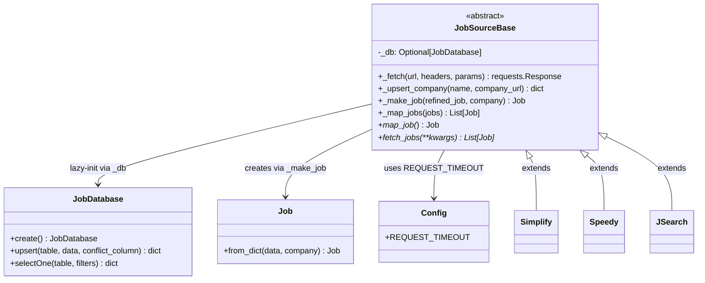

```mermaid
%% classDiagram — JobSourceBase structure and relationships
classDiagram
    class JobSourceBase {
        <<abstract>>
        -_db: Optional[JobDatabase]
        +_fetch(url, headers, params) requests.Response
        +_upsert_company(name, company_url) dict
        +_make_job(refined_job, company) Job
        +_map_jobs(jobs) List[Job]
        +_map_job(_) Job
        +fetch_jobs(**kwargs) List[Job]*
    }

    class JobDatabase {
        +create() JobDatabase
        +upsert(table, data, conflict_column) dict
        +selectOne(table, filters) dict
    }

    class Job {
        +from_dict(data, company) Job
    }

    class Config {
        +REQUEST_TIMEOUT
    }

    JobSourceBase --> JobDatabase : lazy-init via _db
    JobSourceBase --> Job : creates via _make_job
    JobSourceBase --> Config : uses REQUEST_TIMEOUT
    JobSourceBase <|-- Simplify : extends
    JobSourceBase <|-- Speedy : extends
    JobSourceBase <|-- JSearch : extends
```