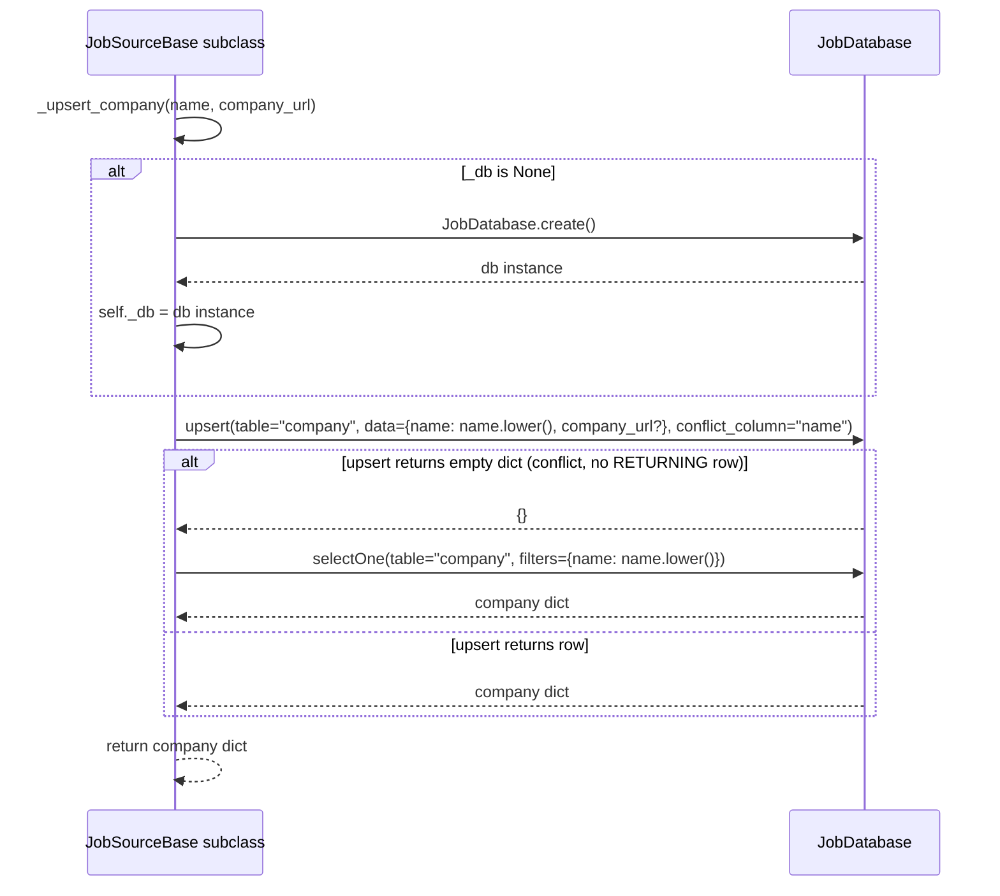
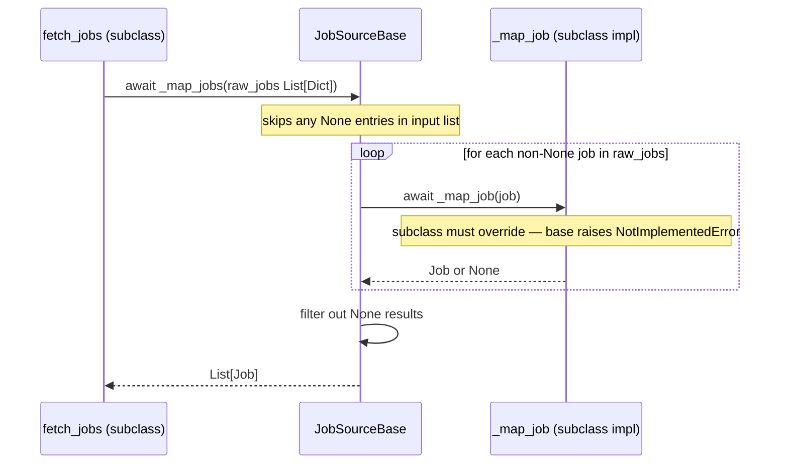

```mermaid
%% sequenceDiagram — _upsert_company flow
sequenceDiagram
    participant Source as JobSourceBase subclass
    participant DB as JobDatabase

    Source->>Source: _upsert_company(name, company_url)
    alt _db is None
        Source->>DB: JobDatabase.create()
        DB-->>Source: db instance
        Source->>Source: self._db = db instance
    end
    Source->>DB: upsert(table="company", data={name: name.lower(), company_url?}, conflict_column="name")
    alt upsert returns empty dict (conflict, no RETURNING row)
        DB-->>Source: {}
        Source->>DB: selectOne(table="company", filters={name: name.lower()})
        DB-->>Source: company dict
    else upsert returns row
        DB-->>Source: company dict
    end
    Source-->>Source: return company dict
```

```mermaid
%% sequenceDiagram — _map_jobs pipeline (iterate, map, filter None)
sequenceDiagram
    participant Caller as fetch_jobs (subclass)
    participant Base as JobSourceBase
    participant Sub as _map_job (subclass impl)

    Caller->>Base: await _map_jobs(raw_jobs List[Dict])
    Note over Base: skips any None entries in input list
    loop for each non-None job in raw_jobs
        Base->>Sub: await _map_job(job)
        Note over Sub: subclass must override — base raises NotImplementedError
        Sub-->>Base: Job or None
    end
    Base->>Base: filter out None results
    Base-->>Caller: List[Job]
```