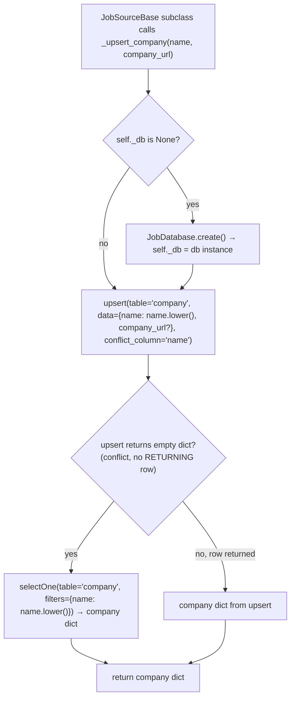

```mermaid
%% flowchart — _map_jobs pipeline (iterate, map, filter None)
flowchart TD
    A["Caller (fetch_jobs) calls await _map_jobs(raw_jobs List[Dict])"] --> B["skip any None entries in input list"]
    B --> C[loop for each non-None job in raw_jobs]
    C --> D["await _map_job(job)<br/>(subclass must override — base raises NotImplementedError)"]
    D --> E[collect result: Job or None]
    E --> F{more jobs in raw_jobs?}
    F -->|yes| C
    F -->|no| G[filter out None results]
    G --> H[return List[Job] to Caller]
```
