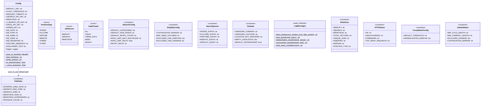

```mermaid
%% classDiagram — constants.py: all config and enum classes
classDiagram
    class Config {
        +DEFAULT_URL: str
        +FUZZY_THRESHOLD: int
        +REQUEST_TIMEOUT: int
        +JSEARCH_API_URL: str
        +REMOTEOK: str
        +J_SEARCH_API_KEY: str
        +GROQ_API_KEY: str
        +GEMINI_KEY: str
        +DB_HOST: str
        +DB_PORT: int
        +DB_NAME: str
        +DB_USER: str
        +DB_PASSWORD: str
        +DISCORD_WEBHOOK: str
        +DISCLAIMER_TEXT: str
        +logger: Logger
        +save_to_json(jobs, filepath)$
        +strip_html(text) str$
        +clean_ws(text) str$
        +is_missing(value) bool$
        +_norm_amount(s) float$
    }

    class PositionType {
        <<enum>>
        INTERN
        FULLTIME
        PARTIME
        REMOTE
        HYBRID
        OTHER
    }

    class JobSource {
        <<enum>>
        SIMPLIFY
        JSEARCH
        REMOTEOK
    }

    class DatePosted {
        <<enum>>
        ALL
        TODAY
        THREE_DAYS
        WEEK
        MONTH
    }

    class JSearchConfig {
        <<constants>>
        +DEFAULT_CATEGORIES: list
        +DEFAULT_NUM_PAGES: str
        +DEFAULT_RETRY_COUNT: int
        +RATE_LIMIT_WAIT_MULTIPLIER: int
        +RATE_LIMIT_DELAY: float
        +RETRY_DELAY: int
    }

    class SimplifyConfig {
        <<constants>>
        +CONTINUATION_MARKER: str
        +MIN_TABLE_COLUMNS: int
        +EXCLUDED_LINK_PREFIXES: list
        +EXCLUDED_LINK_DOMAINS: list
    }

    class SearchQueries {
        <<constants>>
        +INTERN_SUFFIX: str
        +FULLTIME_SUFFIX: str
        +PARTTIME_SUFFIX: str
        +REMOTE_SUFFIX: str
        +DEFAULT_QUERY: str
    }

    class FilePaths {
        <<constants>>
        +SCRAPED_JOBS_JSON: str
        +JSEARCH_RAW_JOBS: str
        +JSEARCH_JOBS: str
        +REMOTEOK_RAW: str
        +REMOTEOK_INTERNSHIPS: str
        +SPONSOR_CACHE: str
    }

    class Defaults {
        <<constants>>
        +UNKNOWN_COMPANY: str
        +UNKNOWN_LOCATION: str
        +LOCATION_NOT_SPECIFIED: str
        +EMPTY_HIGHLIGHTS: dict
        +DEFAULT_SPONSORSHIP: bool
    }

    class LogMessages {
        <<static methods>>
        +fetch_start(source, position_type, date_posted) str$
        +jobs_found(count, query) str$
        +deduplication_result(original, unique) str$
        +sponsorship_tagged(tagged, total) str$
        +bulk_insert_complete(count) str$
    }

    class StatsKeys {
        <<constants>>
        +SIMPLIFY: str
        +JSEARCH: str
        +REMOTEOK: str
        +TOTAL_FETCHED: str
        +UNIQUE_JOBS: str
        +INSERTED: str
        +ERRORS: str
        +POSITION_TYPE: str
    }

    class JSearchConfig
    class HTTPStatus {
        <<constants>>
        +OK: int
        +UNAUTHORIZED: int
        +FORBIDDEN: int
        +TOO_MANY_REQUESTS: int
    }

    class FuzzyMatchConfig {
        <<constants>>
        +DEFAULT_THRESHOLD: int
        +NORMALIZATION_REMOVE: list
    }

    class JobValidation {
        <<constants>>
        +MIN_TITLE_LENGTH: int
        +MIN_COMPANY_LENGTH: int
        +EXCLUDED_DOMAINS: list
        +CONTINUATION_MARKER: str
    }

    Config --> FilePaths : save_to_json default path
```