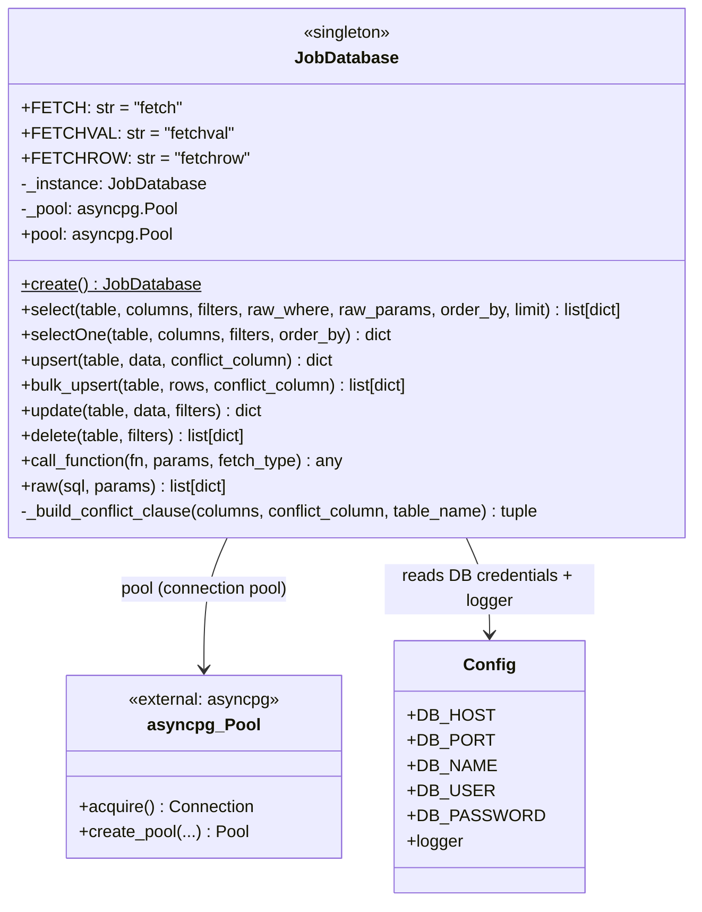

```mermaid
%% classDiagram — JobDatabase structure and relationships
classDiagram
    class JobDatabase {
        <<singleton>>
        +FETCH: str = "fetch"
        +FETCHVAL: str = "fetchval"
        +FETCHROW: str = "fetchrow"
        -_instance: JobDatabase
        -_pool: asyncpg.Pool
        +pool: asyncpg.Pool
        +create() JobDatabase$
        +select(table, columns, filters, raw_where, raw_params, order_by, limit) list[dict]
        +selectOne(table, columns, filters, order_by) dict
        +upsert(table, data, conflict_column) dict
        +bulk_upsert(table, rows, conflict_column) list[dict]
        +update(table, data, filters) dict
        +delete(table, filters) list[dict]
        +call_function(fn, params, fetch_type) any
        +raw(sql, params) list[dict]
        -_build_conflict_clause(columns, conflict_column, table_name) tuple
    }

    class asyncpg_Pool {
        <<external: asyncpg>>
        +acquire() Connection
        +create_pool(...) Pool
    }

    class Config {
        +DB_HOST
        +DB_PORT
        +DB_NAME
        +DB_USER
        +DB_PASSWORD
        +logger
    }

    JobDatabase --> asyncpg_Pool : pool (connection pool)
    JobDatabase --> Config : reads DB credentials + logger
```