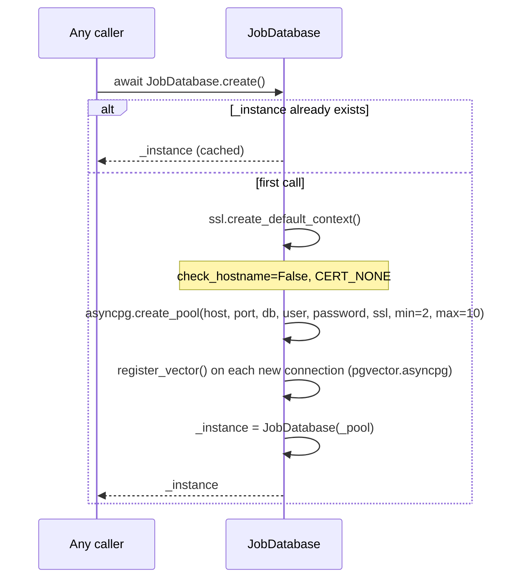
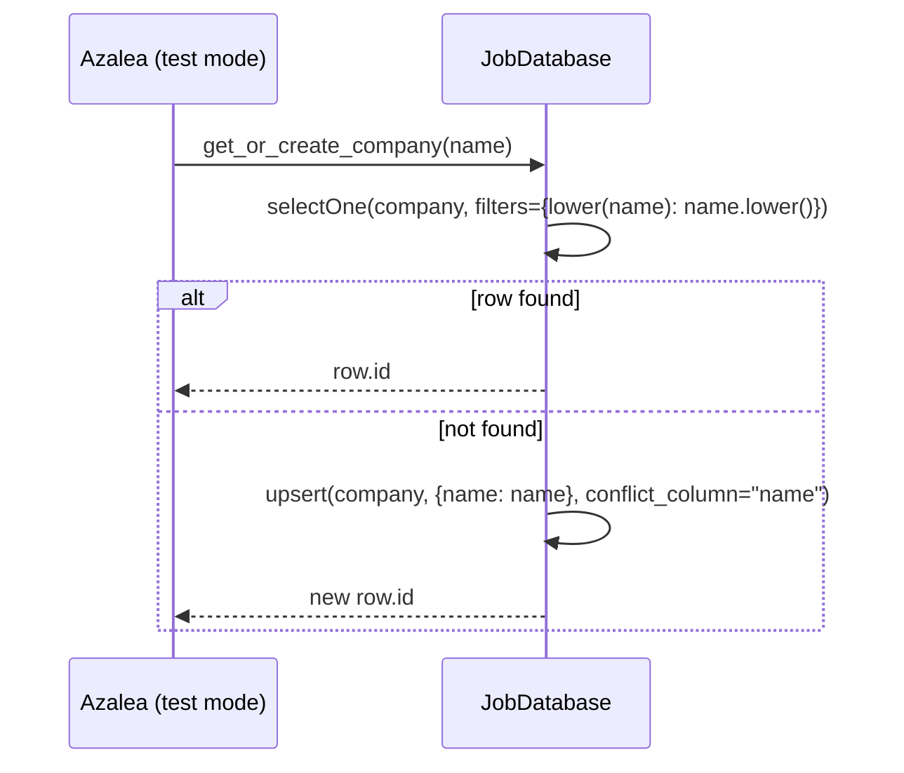
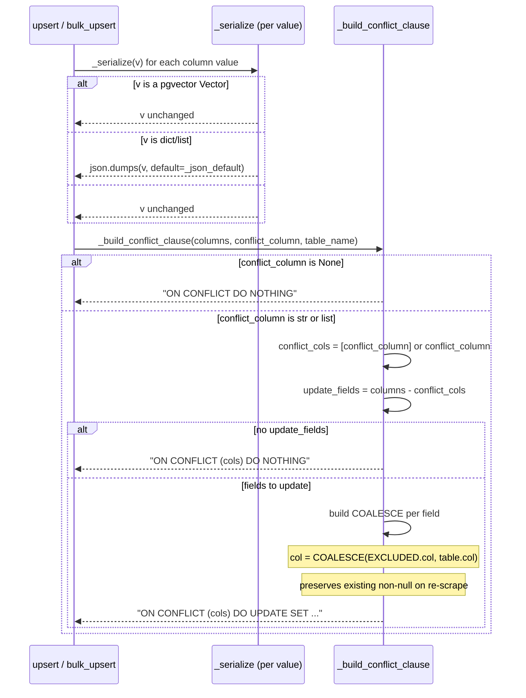

```mermaid
%% sequenceDiagram — create() singleton + pool init
sequenceDiagram
    participant Caller as Any caller
    participant DB as JobDatabase

    Caller->>DB: await JobDatabase.create()

    alt _instance already exists
        DB-->>Caller: _instance (cached)
    else first call
        DB->>DB: ssl.create_default_context()
        Note over DB: check_hostname=False, CERT_NONE
        DB->>DB: asyncpg.create_pool(host, port, db, user, password, ssl, min=2, max=10)
        DB->>DB: register_vector() on each new connection (pgvector.asyncpg)
        DB->>DB: _instance = JobDatabase(_pool)
        DB-->>Caller: _instance
    end

```

```mermaid
%% sequenceDiagram — get_or_create_company (new)
sequenceDiagram
    participant Caller as Azalea (test mode)
    participant DB as JobDatabase

    Caller->>DB: get_or_create_company(name)
    DB->>DB: selectOne(company, filters={lower(name): name.lower()})
    alt row found
        DB-->>Caller: row.id
    else not found
        DB->>DB: upsert(company, {name: name}, conflict_column="name")
        DB-->>Caller: new row.id
    end
```

```mermaid
%% sequenceDiagram — _build_conflict_clause (ON CONFLICT strategy)
sequenceDiagram
    participant Op as upsert / bulk_upsert
    participant Ser as _serialize (per value)
    participant B as _build_conflict_clause

    Op->>Ser: _serialize(v) for each column value
    alt v is a pgvector Vector
        Ser-->>Op: v unchanged
    else v is dict/list
        Ser-->>Op: json.dumps(v, default=_json_default)
    else
        Ser-->>Op: v unchanged
    end

    Op->>B: _build_conflict_clause(columns, conflict_column, table_name)

    alt conflict_column is None
        B-->>Op: "ON CONFLICT DO NOTHING"
    else conflict_column is str or list
        B->>B: conflict_cols = [conflict_column] or conflict_column
        B->>B: update_fields = columns - conflict_cols
        alt no update_fields
            B-->>Op: "ON CONFLICT (cols) DO NOTHING"
        else fields to update
            B->>B: build COALESCE per field
            Note over B: col = COALESCE(EXCLUDED.col, table.col)
            Note over B: preserves existing non-null on re-scrape
            B-->>Op: "ON CONFLICT (cols) DO UPDATE SET ..."
        end
    end

```