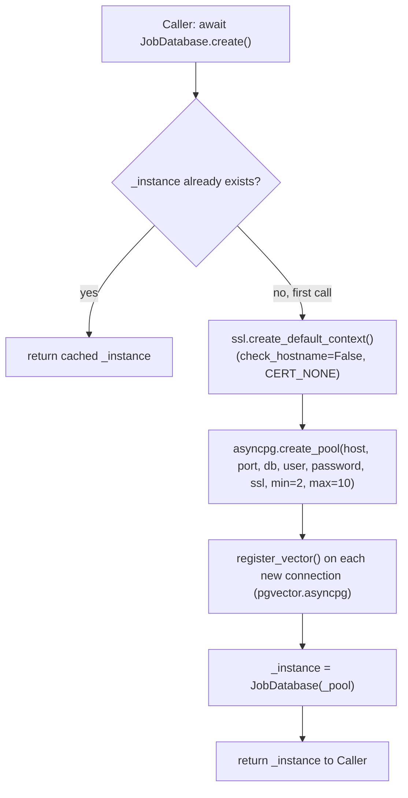
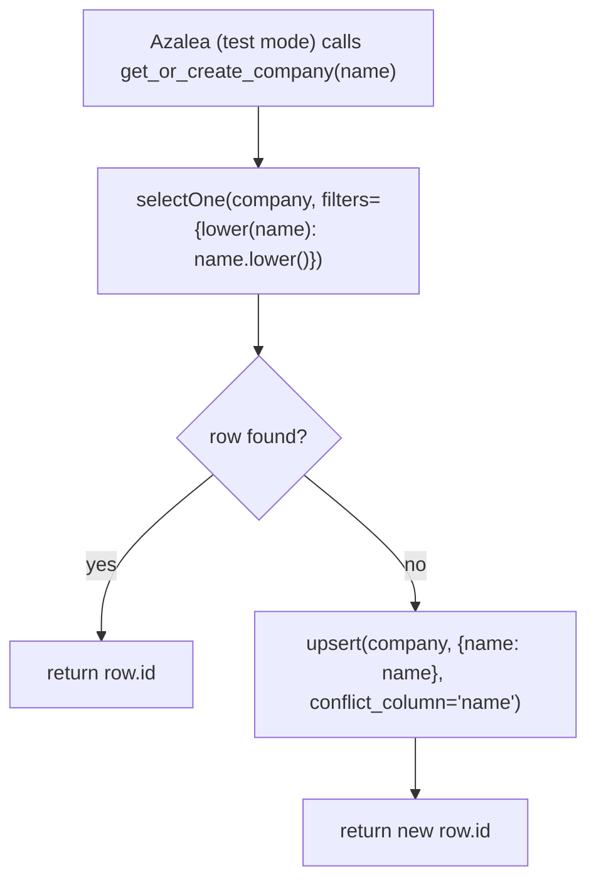
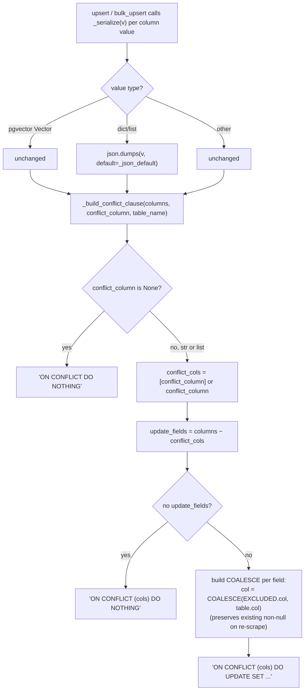

```mermaid
%% flowchart — create() singleton + pool init
flowchart TD
    A["Caller: await JobDatabase.create()"] --> B{_instance already exists?}
    B -->|yes| C["return cached _instance"]
    B -->|no, first call| D["ssl.create_default_context()<br/>(check_hostname=False, CERT_NONE)"]
    D --> E["asyncpg.create_pool(host, port, db, user, password, ssl, min=2, max=10)"]
    E --> F["register_vector() on each new connection (pgvector.asyncpg)"]
    F --> G["_instance = JobDatabase(_pool)"]
    G --> H[return _instance to Caller]
```

```mermaid
%% flowchart — get_or_create_company (new)
flowchart TD
    A["Azalea (test mode) calls get_or_create_company(name)"] --> B["selectOne(company, filters={lower(name): name.lower()})"]
    B --> C{row found?}
    C -->|yes| D[return row.id]
    C -->|no| E["upsert(company, {name: name}, conflict_column='name')"]
    E --> F[return new row.id]
```

```mermaid
%% flowchart — _build_conflict_clause (ON CONFLICT strategy)
flowchart TD
    A["upsert / bulk_upsert calls _serialize(v) per column value"] --> B{value type?}
    B -->|pgvector Vector| C[unchanged]
    B -->|dict/list| D["json.dumps(v, default=_json_default)"]
    B -->|other| E[unchanged]
    C --> F["_build_conflict_clause(columns, conflict_column, table_name)"]
    D --> F
    E --> F
    F --> G{conflict_column is None?}
    G -->|yes| H["'ON CONFLICT DO NOTHING'"]
    G -->|no, str or list| I["conflict_cols = [conflict_column] or conflict_column"]
    I --> J["update_fields = columns − conflict_cols"]
    J --> K{no update_fields?}
    K -->|yes| L["'ON CONFLICT (cols) DO NOTHING'"]
    K -->|no| M["build COALESCE per field:<br/>col = COALESCE(EXCLUDED.col, table.col)<br/>(preserves existing non-null on re-scrape)"]
    M --> N["'ON CONFLICT (cols) DO UPDATE SET ...'"]
```
