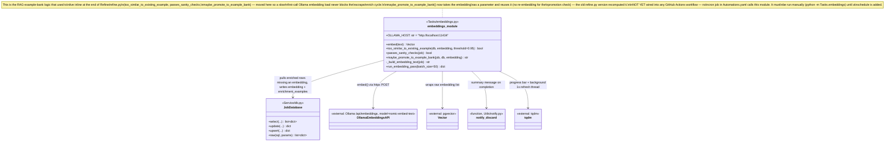

```mermaid
%% classDiagram — Tasks/embeddings.py (new module, no prior diagram)
%% Standalone embedding + example-bank promotion pass, decoupled from enrich_unenriched_jobs().
classDiagram
    class embeddings_module {
        <<Tasks/embeddings.py>>
        +OLLAMA_HOST: str = "http://localhost:11434"
        +embed(text) Vector
        +too_similar_to_existing_example(db, embedding, threshold=0.95) bool
        +passes_sanity_checks(job) bool
        +maybe_promote_to_example_bank(job, db, embedding) str
        -_build_embedding_text(job) str
        +run_embedding_pass(batch_size=50) dict
    }

    class JobDatabase {
        <<Service/db.py>>
        +select(...) list~dict~
        +update(...) dict
        +upsert(...) dict
        +raw(sql, params) list~dict~
    }

    class OllamaEmbeddingsAPI {
        <<external: Ollama /api/embeddings, model=nomic-embed-text>>
    }

    class Vector {
        <<external: pgvector>>
    }

    class notify_discord {
        <<function, Utils/notify.py>>
    }

    class tqdm {
        <<external: tqdm>>
    }

    embeddings_module --> JobDatabase : pulls enriched rows missing an embedding, writes embedding + enrichment_examples
    embeddings_module --> OllamaEmbeddingsAPI : embed() via httpx POST
    embeddings_module --> Vector : wraps raw embedding list
    embeddings_module --> notify_discord : summary message on completion
    embeddings_module --> tqdm : progress bar + background 1s refresh thread

    note for embeddings_module "This is the RAG-example-bank logic that used to\nlive inline at the end of Refine/refine.py\n(too_similar_to_existing_example, passes_sanity_checks,\nmaybe_promote_to_example_bank) — moved here so a slow\nfirst-call Ollama embedding load never blocks the\nscrape/enrich cycle.\n\nmaybe_promote_to_example_bank() now takes the embedding\nas a parameter and reuses it (no re-embedding for the\npromotion check) — the old refine.py version recomputed it.\n\nNOT YET wired into any GitHub Actions workflow — no\ncron job in Automations.yaml calls this module. It must\nbe run manually (python -m Tasks.embeddings) until a\nschedule is added."
```
