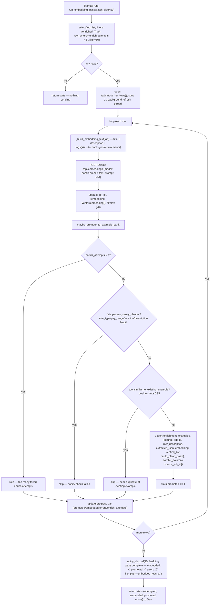

```mermaid
%% flowchart — run_embedding_pass() batch loop
flowchart TD
    A["Manual run: run_embedding_pass(batch_size=50)"] --> B["select(job_list, filters={enriched: True}, raw_where='enrich_attempts < 5', limit=50)"]
    B --> C{any rows?}
    C -->|no| Z[return stats — nothing pending]
    C -->|yes| D["open tqdm(total=len(rows)); start 1s background refresh thread"]
    D --> E[loop each row]
    E --> F["_build_embedding_text(job) — title + description + tags(skills/technologies/requirements)"]
    F --> G["POST Ollama /api/embeddings {model: nomic-embed-text, prompt: text}"]
    G --> H["update(job_list, {embedding: Vector(embedding)}, filters={id})"]
    H --> I[maybe_promote_to_example_bank]
    I --> J{enrich_attempts > 1?}
    J -->|yes| K[skip — too many failed enrich attempts]
    J -->|no| L{fails passes_sanity_checks?<br/>role_type/pay_range/location/description length}
    L -->|yes| M[skip — sanity check failed]
    L -->|no| N{too_similar_to_existing_example?<br/>cosine sim ≥ 0.95}
    N -->|yes| O[skip — near-duplicate of existing example]
    N -->|no| P["upsert(enrichment_examples, {source_job_id, raw_description,<br/>extracted_json, embedding, verified_by: 'auto_clean_pass'},<br/>conflict_column=[source_job_id])"]
    P --> Q["stats.promoted += 1"]
    K --> R["update progress bar (promoted/embedded/errors/enrich_attempts)"]
    M --> R
    O --> R
    Q --> R
    R --> S{more rows?}
    S -->|yes| E
    S -->|no| T["notify_discord('Embedding pass complete — embedded: X, promoted: Y, errors: Z', file_path='embedded_jobs.txt')"]
    T --> U["return stats {attempted, embedded, promoted, errors} to Dev"]
```
