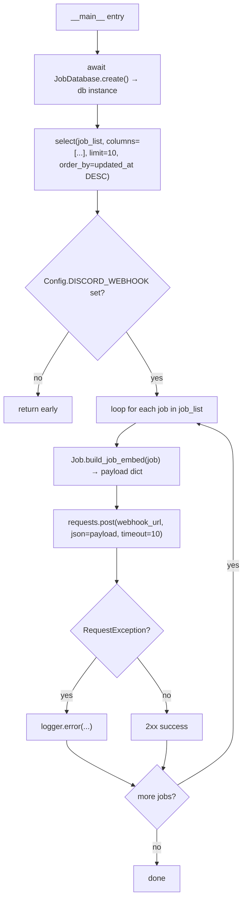

```mermaid
%% flowchart — Tasks/enrich.py main() (DB fetch → Discord embed post)
flowchart TD
    A["__main__ entry"] --> B["await JobDatabase.create() → db instance"]
    B --> C["select(job_list, columns=[...], limit=10, order_by=updated_at DESC)"]
    C --> D{Config.DISCORD_WEBHOOK set?}
    D -->|no| Z[return early]
    D -->|yes| E[loop for each job in job_list]
    E --> F["Job.build_job_embed(job) → payload dict"]
    F --> G["requests.post(webhook_url, json=payload, timeout=10)"]
    G --> H{RequestException?}
    H -->|yes| I["logger.error(...)"]
    H -->|no| J[2xx success]
    I --> K{more jobs?}
    J --> K
    K -->|yes| E
    K -->|no| L[done]
```
