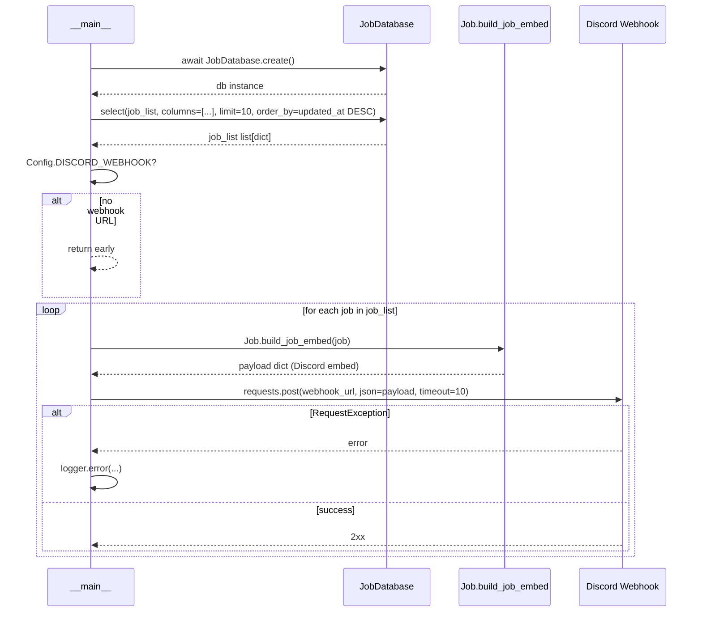

```mermaid
%% sequenceDiagram — Tasks/enrich.py main() (DB fetch → Discord embed post)
sequenceDiagram
    participant Entry as __main__
    participant DB as JobDatabase
    participant Job as Job.build_job_embed
    participant Discord as Discord Webhook

    Entry->>DB: await JobDatabase.create()
    DB-->>Entry: db instance

    Entry->>DB: select(job_list, columns=[...], limit=10, order_by=updated_at DESC)
    DB-->>Entry: job_list list[dict]

    Entry->>Entry: Config.DISCORD_WEBHOOK?
    alt no webhook URL
        Entry-->>Entry: return early
    end

    loop for each job in job_list
        Entry->>Job: Job.build_job_embed(job)
        Job-->>Entry: payload dict (Discord embed)

        Entry->>Discord: requests.post(webhook_url, json=payload, timeout=10)
        alt RequestException
            Discord-->>Entry: error
            Entry->>Entry: logger.error(...)
        else success
            Discord-->>Entry: 2xx
        end
    end

```