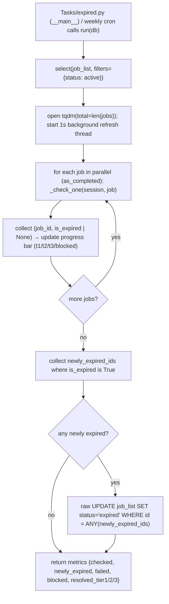

```mermaid
%% flowchart — _check_one() tiered escalation for a single job
flowchart TD
    A["ExpiryChecker.run calls _cheap_check(session, apply_url) — tier 1<br/>(http_semaphore)"] --> B["HEAD request → DEAD_STATUS_CODES / redirect-looks-expired?"]
    B --> C{confident from HEAD?}
    C -->|yes| D[return True/False]
    C -->|no, inconclusive| E["GET request, read first GET_BYTE_LIMIT bytes"]
    E --> F{in SPA_ONLY_DOMAINS?}
    F -->|yes| G["return None — escalate (raw HTML is an empty JS shell)"]
    F -->|no| H["classify_scraped_text(visible_text)"]
    H --> I{classification?}
    I -->|expired/ok| D
    I -->|garbage| G
    D --> J{tier 1 resolved (not None)?}
    G --> J
    J -->|yes| K["resolved_tier1 += 1"]
    J -->|no, inconclusive| L["_deep_check(apply_url) — tiers 2/3 (heavy_semaphore)"]
    L --> M["Pirate.scrape_apply_url(apply_url)"]
    M --> N{result type?}
    N -->|None| O[return None — failed]
    N -->|"dict, blocked=True"| P["return None — metrics.blocked += 1<br/>(NOT treated as expired)"]
    N -->|"dict, job_expired True/False"| Q["return True/False — metrics.resolved_tier2 += 1"]
    N -->|ScrapeResult| R["classify_scraped_text(scraped.raw_text)"]
    R --> S{classification?}
    S -->|expired| T["return True (resolved_tier2 += 1)"]
    S -->|garbage| U[return None]
    S -->|ok| V["LLM: check_expired(scraped.raw_text)"]
    V --> W{model gives clear verdict?}
    W -->|yes| X["return True/False (resolved_tier3 += 1)"]
    W -->|no| Y[return None]
```
