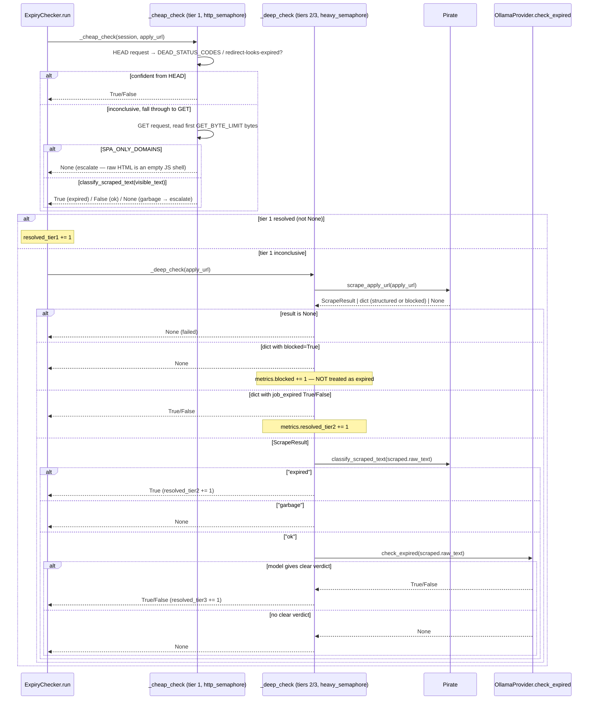

```mermaid
%% sequenceDiagram — ExpiryChecker.run() orchestration
sequenceDiagram
    participant Task as Tasks/expired.py (__main__) / weekly cron
    participant Run as ExpiryChecker.run
    participant DB as JobDatabase
    participant Check as _check_one (per job)
    participant Bar as tqdm progress bar

    Task->>Run: run(db)
    Run->>DB: select(job_list, filters={status: active})
    DB-->>Run: jobs
    Run->>Bar: open tqdm(total=len(jobs)); start 1s background refresh thread

    par for each job (as_completed)
        Run->>Check: _check_one(session, job)
        Check-->>Run: (job_id, is_expired | None)
        Run->>Bar: update(1), set_postfix(t1/t2/t3/blocked)
    end

    Run->>Run: collect newly_expired_ids where is_expired is True
    alt any newly expired
        Run->>DB: raw("UPDATE job_list SET status='expired' WHERE id = ANY($1)", [newly_expired_ids])
    end

    Run-->>Task: metrics {checked, newly_expired, failed, blocked, resolved_tier1/2/3}
```


