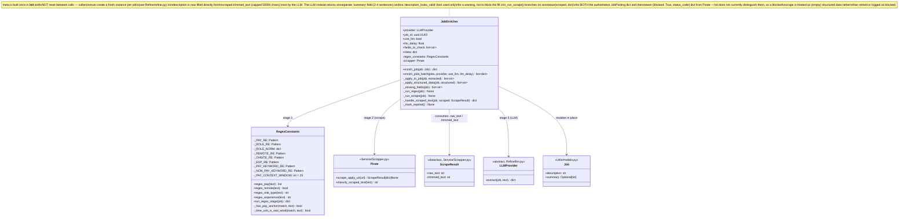

```mermaid
%% classDiagram — JobEnricher orchestrator + RegexConstants
classDiagram
    class JobEnricher {
        +provider: LLMProvider
        +job_id: uuid.UUID
        +use_llm: bool
        +llm_delay: float
        +fields_to_check: list~str~
        +meta: dict
        -regex_constants: RegexConstants
        -scrapper: Pirate
        +enrich_job(job: Job) dict
        +enrich_jobs_batch(jobs, provider, use_llm, llm_delay) list~dict~
        -_apply_to_job(job, extracted) list~str~
        -_apply_structured_data(job, structured) list~str~
        -_missing_fields(job) list~str~
        -_run_regex(job) None
        -_run_scrape(job) None
        -_handle_scraped_text(job, scraped: ScrapeResult) dict
        -_mark_expired() None
    }

    class RegexConstants {
        -_PAY_RE: Pattern
        -_ROLE_RE: Pattern
        -_ROLE_NORM: dict
        -_REMOTE_RE: Pattern
        -_ONSITE_RE: Pattern
        -_EXP_RE: Pattern
        -_PAY_KEYWORD_RE: Pattern
        -_NON_PAY_KEYWORD_RE: Pattern
        -_PAY_CONTEXT_WINDOW: int = 25
        +regex_pay(text) list
        +regex_remote(text) bool
        +regex_role_type(text) str
        +regex_experience(text) str
        +run_regex_stage(job) dict
        -_has_pay_anchor(match, text) bool
        -_time_unit_is_real_word(match, text) bool
    }

    class Pirate {
        <<Service/Scrapper.py>>
        +scrape_apply_url(url) ScrapeResult|dict|None
        +classify_scraped_text(text) str
    }

    class ScrapeResult {
        <<dataclass, Service/Scrapper.py>>
        +raw_text: str
        +trimmed_text: str
    }

    class LLMProvider {
        <<abstract, Refine/llm.py>>
        +extract(job, text) dict
    }

    class Job {
        <<Utils/models.py>>
        +description: str
        +summary: Optional[str]
    }

    JobEnricher --> RegexConstants : stage 1
    JobEnricher --> Pirate : stage 2 (scrape)
    JobEnricher --> ScrapeResult : consumes .raw_text / .trimmed_text
    JobEnricher --> LLMProvider : stage 3 (LLM)
    JobEnricher --> Job : mutates in place

    note for JobEnricher "meta is built once in __init__ and\nNOT reset between calls — callers\nmust create a fresh instance per job\n(see Refine/refine.py).\n\ndescription is now filled directly from\nscraped.trimmed_text (capped 50000 chars),\nnot by the LLM. The LLM instead returns a\nseparate 'summary' field (2-4 sentences) and\na 'description_looks_valid' bool used only\nfor a warning, not to block the fill.\n\n_run_scrape() branches on isinstance(scraped, dict)\nfor BOTH the authoritative JobPosting dict and the\nnewer {blocked: True, status_code} dict from Pirate —\nit does not currently distinguish them, so a blocked\nscrape is treated as (empty) structured data rather\nthan retried or logged as blocked."
```