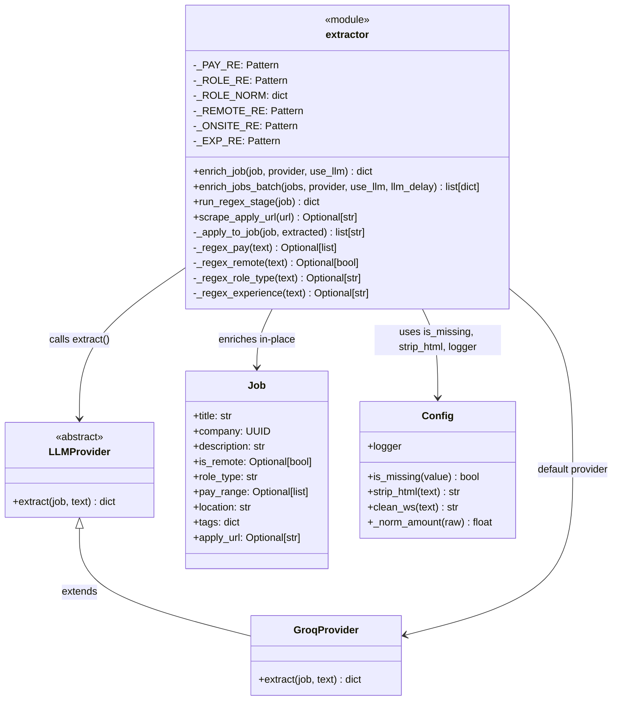

```mermaid
%% classDiagram — extractor module functions and relationships
classDiagram
    class extractor {
        <<module>>
        +enrich_job(job, provider, use_llm) dict
        +enrich_jobs_batch(jobs, provider, use_llm, llm_delay) list[dict]
        +run_regex_stage(job) dict
        +scrape_apply_url(url) Optional[str]
        -_apply_to_job(job, extracted) list[str]
        -_regex_pay(text) Optional[list]
        -_regex_remote(text) Optional[bool]
        -_regex_role_type(text) Optional[str]
        -_regex_experience(text) Optional[str]
        -_PAY_RE: Pattern
        -_ROLE_RE: Pattern
        -_ROLE_NORM: dict
        -_REMOTE_RE: Pattern
        -_ONSITE_RE: Pattern
        -_EXP_RE: Pattern
    }

    class LLMProvider {
        <<abstract>>
        +extract(job, text) dict
    }

    class GroqProvider {
        +extract(job, text) dict
    }

    class Job {
        +title: str
        +company: UUID
        +description: str
        +is_remote: Optional[bool]
        +role_type: str
        +pay_range: Optional[list]
        +location: str
        +tags: dict
        +apply_url: Optional[str]
    }

    class Config {
        +is_missing(value) bool
        +strip_html(text) str
        +clean_ws(text) str
        +_norm_amount(raw) float
        +logger
    }

    LLMProvider <|-- GroqProvider : extends
    extractor --> LLMProvider : calls extract()
    extractor --> GroqProvider : default provider
    extractor --> Job : enriches in-place
    extractor --> Config : uses is_missing, strip_html, logger

```