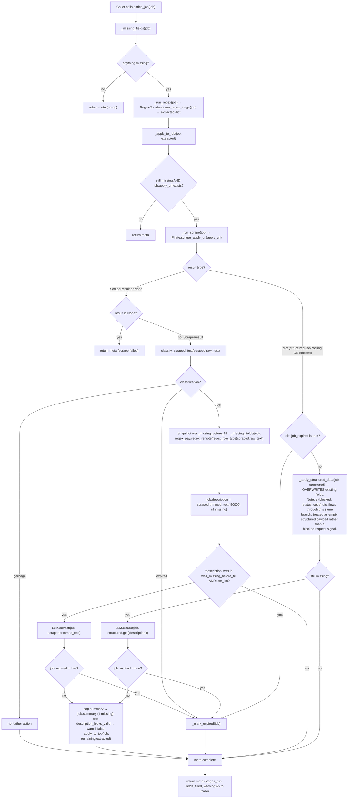

```mermaid
%% flowchart — JobEnricher.enrich_job() full pipeline
flowchart TD
    A["Caller calls enrich_job(job)"] --> B["_missing_fields(job)"]
    B --> C{anything missing?}
    C -->|no| Z1["return meta (no-op)"]
    C -->|yes| D["_run_regex(job) → RegexConstants.run_regex_stage(job) → extracted dict"]
    D --> E["_apply_to_job(job, extracted)"]
    E --> F{still missing AND job.apply_url exists?}
    F -->|no| Z2[return meta]
    F -->|yes| G["_run_scrape(job) → Pirate.scrape_apply_url(apply_url)"]
    G --> H{result type?}
    H -->|"dict (structured JobPosting OR blocked)"| I{dict.job_expired is true?}
    I -->|yes| J["_mark_expired(job)"]
    I -->|no| K["_apply_structured_data(job, structured) — OVERWRITES existing fields.<br/>Note: a {blocked, status_code} dict flows through this same<br/>branch, treated as empty structured payload rather than a<br/>blocked-request signal."]
    K --> L{still missing?}
    L -->|yes| M["LLM.extract(job, structured.get('description'))"]
    M --> N{job_expired = true?}
    N -->|yes| J
    N -->|no| O["pop summary → job.summary (if missing);<br/>pop description_looks_valid → warn if false;<br/>_apply_to_job(job, remaining extracted)"]
    L -->|no| P[meta complete]
    H -->|"ScrapeResult or None"| Q{result is None?}
    Q -->|yes| Z3["return meta (scrape failed)"]
    Q -->|no, ScrapeResult| R["classify_scraped_text(scraped.raw_text)"]
    R --> S{classification?}
    S -->|expired| J
    S -->|garbage| T[no further action]
    S -->|ok| U["snapshot was_missing_before_fill = _missing_fields(job);<br/>regex_pay/regex_remote/regex_role_type(scraped.raw_text)"]
    U --> V["job.description = scraped.trimmed_text[:50000] (if missing)"]
    V --> W{"'description' was in was_missing_before_fill AND use_llm?"}
    W -->|no| P
    W -->|yes| X["LLM.extract(job, scraped.trimmed_text)"]
    X --> Y{job_expired = true?}
    Y -->|yes| J
    Y -->|no| O
    J --> P
    O --> P
    T --> P
    P --> Z4["return meta {stages_run, fields_filled, warnings?} to Caller"]
```
