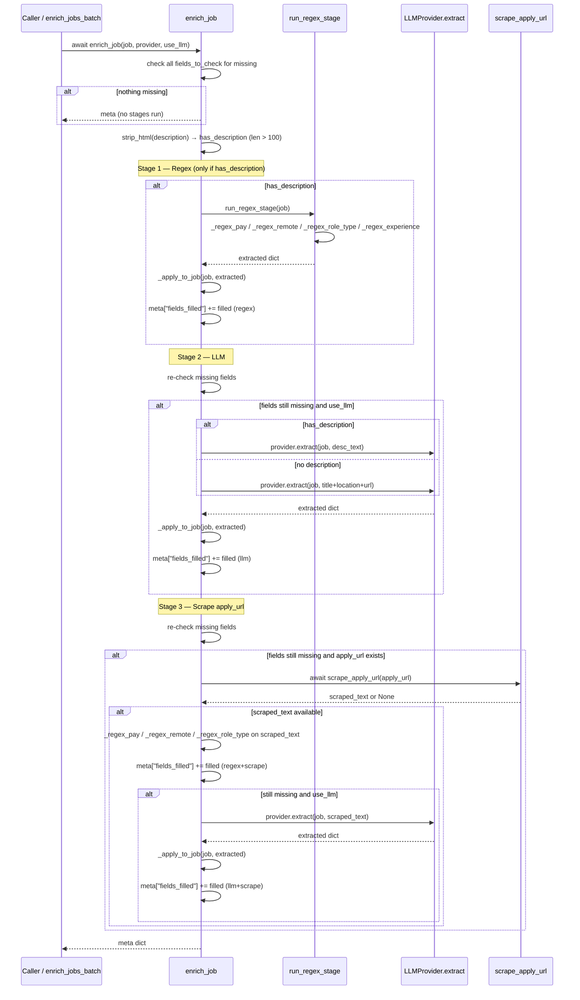
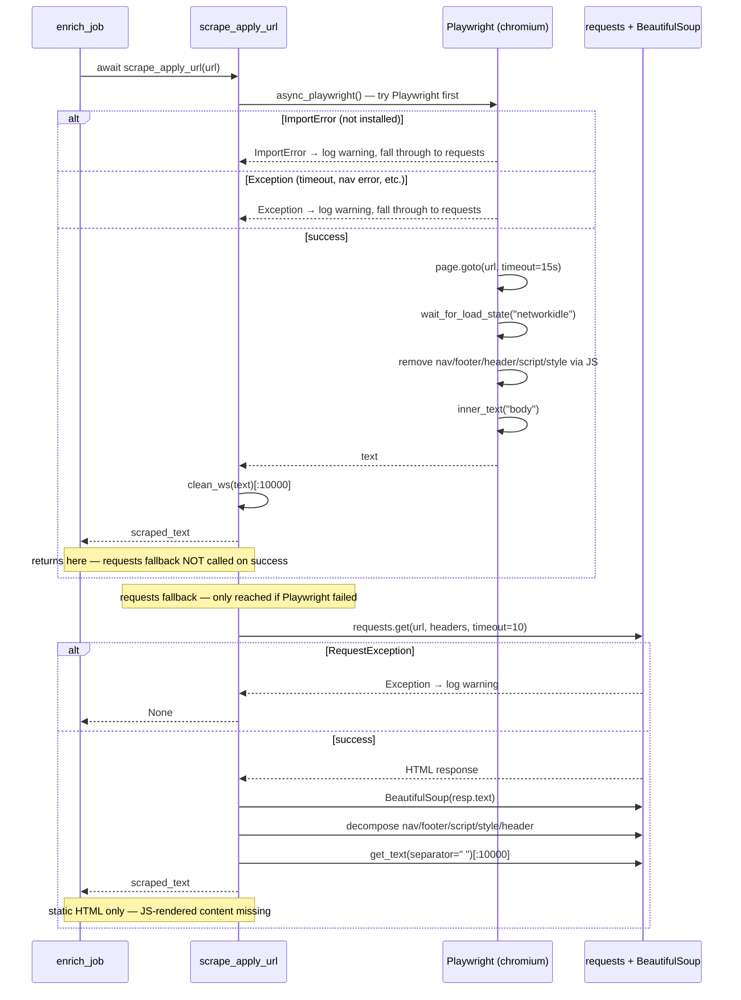
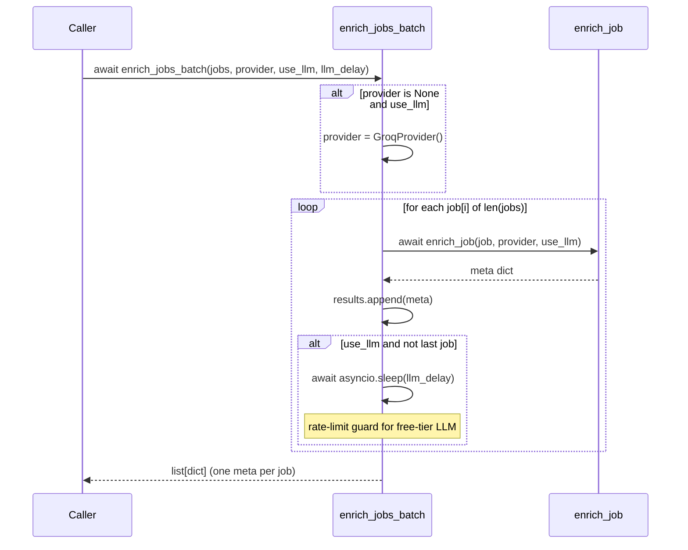

```mermaid
%% sequenceDiagram — enrich_job (3-stage enrichment pipeline)
sequenceDiagram
    participant Caller as Caller / enrich_jobs_batch
    participant E as enrich_job
    participant Regex as run_regex_stage
    participant LLM as LLMProvider.extract
    participant Scraper as scrape_apply_url

    Caller->>E: await enrich_job(job, provider, use_llm)
    E->>E: check all fields_to_check for missing
    alt nothing missing
        E-->>Caller: meta (no stages run)
    end

    E->>E: strip_html(description) → has_description (len > 100)

    note over E: Stage 1 — Regex (only if has_description)
    alt has_description
        E->>Regex: run_regex_stage(job)
        Regex->>Regex: _regex_pay / _regex_remote / _regex_role_type / _regex_experience
        Regex-->>E: extracted dict
        E->>E: _apply_to_job(job, extracted)
        E->>E: meta["fields_filled"] += filled (regex)
    end

    note over E: Stage 2 — LLM
    E->>E: re-check missing fields
    alt fields still missing and use_llm
        alt has_description
            E->>LLM: provider.extract(job, desc_text)
        else no description
            E->>LLM: provider.extract(job, title+location+url)
        end
        LLM-->>E: extracted dict
        E->>E: _apply_to_job(job, extracted)
        E->>E: meta["fields_filled"] += filled (llm)
    end

    note over E: Stage 3 — Scrape apply_url
    E->>E: re-check missing fields
    alt fields still missing and apply_url exists
        E->>Scraper: await scrape_apply_url(apply_url)
        Scraper-->>E: scraped_text or None

        alt scraped_text available
            E->>E: _regex_pay / _regex_remote / _regex_role_type on scraped_text
            E->>E: meta["fields_filled"] += filled (regex+scrape)

            alt still missing and use_llm
                E->>LLM: provider.extract(job, scraped_text)
                LLM-->>E: extracted dict
                E->>E: _apply_to_job(job, extracted)
                E->>E: meta["fields_filled"] += filled (llm+scrape)
            end
        end
    end

    E-->>Caller: meta dict

```

```mermaid
%% sequenceDiagram — scrape_apply_url (Playwright primary, requests fallback only on failure)
sequenceDiagram
    participant E as enrich_job
    participant S as scrape_apply_url
    participant PW as Playwright (chromium)
    participant REQ as requests + BeautifulSoup

    E->>S: await scrape_apply_url(url)

    S->>PW: async_playwright() — try Playwright first
    alt ImportError (not installed)
        PW-->>S: ImportError → log warning, fall through to requests
    else Exception (timeout, nav error, etc.)
        PW-->>S: Exception → log warning, fall through to requests
    else success
        PW->>PW: page.goto(url, timeout=15s)
        PW->>PW: wait_for_load_state("networkidle")
        PW->>PW: remove nav/footer/header/script/style via JS
        PW->>PW: inner_text("body")
        PW-->>S: text
        S->>S: clean_ws(text)[:10000]
        S-->>E: scraped_text
        Note over S,E: returns here — requests fallback NOT called on success
    end

    Note over S: requests fallback — only reached if Playwright failed
    S->>REQ: requests.get(url, headers, timeout=10)
    alt RequestException
        REQ-->>S: Exception → log warning
        S-->>E: None
    else success
        REQ-->>S: HTML response
        S->>REQ: BeautifulSoup(resp.text)
        S->>REQ: decompose nav/footer/script/style/header
        S->>REQ: get_text(separator=" ")[:10000]
        S-->>E: scraped_text
        Note over S,E: static HTML only — JS-rendered content missing
    end

```

```mermaid
%% sequenceDiagram — enrich_jobs_batch (sequential batch with rate-limit delay)
sequenceDiagram
    participant Caller as Caller
    participant B as enrich_jobs_batch
    participant E as enrich_job

    Caller->>B: await enrich_jobs_batch(jobs, provider, use_llm, llm_delay)
    alt provider is None and use_llm
        B->>B: provider = GroqProvider()
    end

    loop for each job[i] of len(jobs)
        B->>E: await enrich_job(job, provider, use_llm)
        E-->>B: meta dict
        B->>B: results.append(meta)
        alt use_llm and not last job
            B->>B: await asyncio.sleep(llm_delay)
            Note over B: rate-limit guard for free-tier LLM
        end
    end

    B-->>Caller: list[dict] (one meta per job)

```