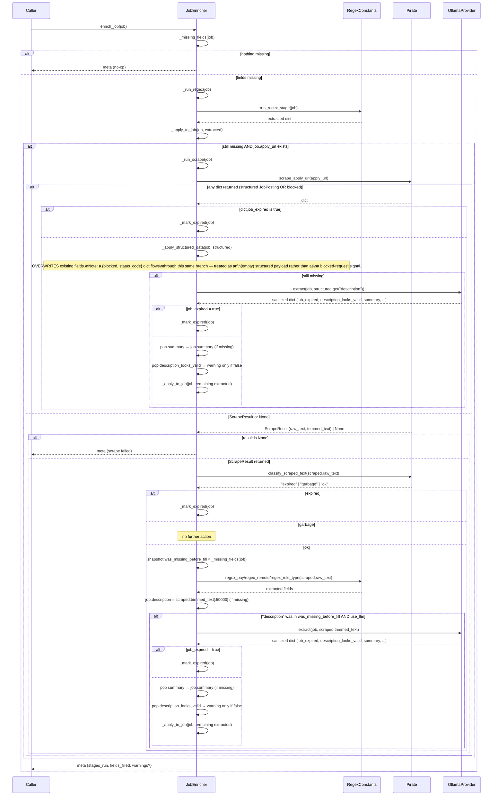

```mermaid
%% sequenceDiagram — JobEnricher.enrich_job() full pipeline
sequenceDiagram
    participant Caller
    participant JE as JobEnricher
    participant RC as RegexConstants
    participant P as Pirate
    participant LLM as OllamaProvider

    Caller->>JE: enrich_job(job)
    JE->>JE: _missing_fields(job)
    alt nothing missing
        JE-->>Caller: meta (no-op)
    else fields missing
        JE->>JE: _run_regex(job)
        JE->>RC: run_regex_stage(job)
        RC-->>JE: extracted dict
        JE->>JE: _apply_to_job(job, extracted)

        alt still missing AND job.apply_url exists
            JE->>JE: _run_scrape(job)
            JE->>P: scrape_apply_url(apply_url)

            alt any dict returned (structured JobPosting OR blocked)
                P-->>JE: dict
                alt dict.job_expired is true
                    JE->>JE: _mark_expired(job)
                else
                    JE->>JE: _apply_structured_data(job, structured)
                    Note over JE: OVERWRITES existing fields.\nNote: a {blocked, status_code} dict flows\nthrough this same branch — treated as an\n(empty) structured payload rather than as\na blocked-request signal.
                    alt still missing
                        JE->>LLM: extract(job, structured.get("description"))
                        LLM-->>JE: sanitized dict {job_expired, description_looks_valid, summary, ...}
                        alt job_expired = true
                            JE->>JE: _mark_expired(job)
                        else
                            JE->>JE: pop summary → job.summary (if missing)
                            JE->>JE: pop description_looks_valid → warning only if false
                            JE->>JE: _apply_to_job(job, remaining extracted)
                        end
                    end
                end
            else ScrapeResult or None
                P-->>JE: ScrapeResult(raw_text, trimmed_text) | None
                alt result is None
                    JE-->>Caller: meta (scrape failed)
                else ScrapeResult returned
                    JE->>P: classify_scraped_text(scraped.raw_text)
                    P-->>JE: "expired" | "garbage" | "ok"
                    alt expired
                        JE->>JE: _mark_expired(job)
                    else garbage
                        Note over JE: no further action
                    else ok
                        JE->>JE: snapshot was_missing_before_fill = _missing_fields(job)
                        JE->>RC: regex_pay/regex_remote/regex_role_type(scraped.raw_text)
                        RC-->>JE: extracted fields
                        JE->>JE: job.description = scraped.trimmed_text[:50000] (if missing)
                        alt "description" was in was_missing_before_fill AND use_llm
                            JE->>LLM: extract(job, scraped.trimmed_text)
                            LLM-->>JE: sanitized dict {job_expired, description_looks_valid, summary, ...}
                            alt job_expired = true
                                JE->>JE: _mark_expired(job)
                            else
                                JE->>JE: pop summary → job.summary (if missing)
                                JE->>JE: pop description_looks_valid → warning only if false
                                JE->>JE: _apply_to_job(job, remaining extracted)
                            end
                        end
                    end
                end
            end
        end
        JE-->>Caller: meta {stages_run, fields_filled, warnings?}
    end
```