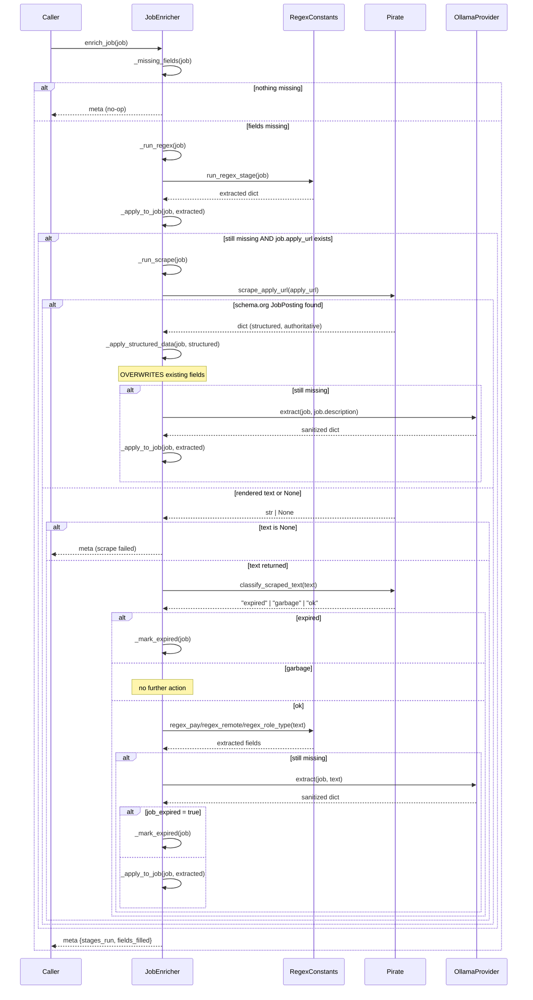

```mermaid
%% sequenceDiagram — JobEnricher.enrich_job() full pipeline
sequenceDiagram
    participant Caller
    participant JE as JobEnricher
    participant RC as RegexConstants
    participant P as Pirate
    participant LLM as OllamaProvider

    Caller->>JE: enrich_job(job)
    JE->>JE: _missing_fields(job)
    alt nothing missing
        JE-->>Caller: meta (no-op)
    else fields missing
        JE->>JE: _run_regex(job)
        JE->>RC: run_regex_stage(job)
        RC-->>JE: extracted dict
        JE->>JE: _apply_to_job(job, extracted)

        alt still missing AND job.apply_url exists
            JE->>JE: _run_scrape(job)
            JE->>P: scrape_apply_url(apply_url)

            alt schema.org JobPosting found
                P-->>JE: dict (structured, authoritative)
                JE->>JE: _apply_structured_data(job, structured)
                Note over JE: OVERWRITES existing fields
                alt still missing
                    JE->>LLM: extract(job, job.description)
                    LLM-->>JE: sanitized dict
                    JE->>JE: _apply_to_job(job, extracted)
                end
            else rendered text or None
                P-->>JE: str | None
                alt text is None
                    JE-->>Caller: meta (scrape failed)
                else text returned
                    JE->>P: classify_scraped_text(text)
                    P-->>JE: "expired" | "garbage" | "ok"
                    alt expired
                        JE->>JE: _mark_expired(job)
                    else garbage
                        Note over JE: no further action
                    else ok
                        JE->>RC: regex_pay/regex_remote/regex_role_type(text)
                        RC-->>JE: extracted fields
                        alt still missing
                            JE->>LLM: extract(job, text)
                            LLM-->>JE: sanitized dict
                            alt job_expired = true
                                JE->>JE: _mark_expired(job)
                            else
                                JE->>JE: _apply_to_job(job, extracted)
                            end
                        end
                    end
                end
            end
        end
        JE-->>Caller: meta {stages_run, fields_filled}
    end
```
