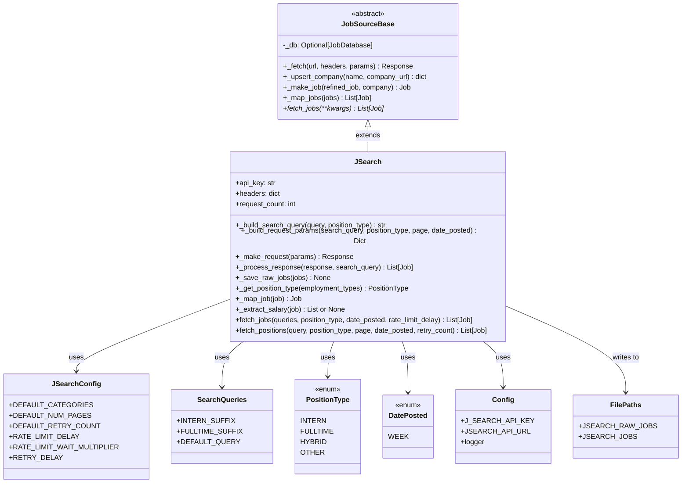

```mermaid
%% classDiagram — JSearch structure and relationships
classDiagram
    class JSearch {
        +api_key: str
        +headers: dict
        +request_count: int
        +_build_search_query(query, position_type) str
        +_build_request_params(search_query, position_type, page, date_posted) Dict
        +_make_request(params) Response
        +_process_response(response, search_query) List[Job]
        +_save_raw_jobs(jobs) None
        +_get_position_type(employment_types) PositionType
        +_map_job(job) Job
        +_extract_salary(job) List or None
        +fetch_jobs(queries, position_type, date_posted, rate_limit_delay) List[Job]
        +fetch_positions(query, position_type, page, date_posted, retry_count) List[Job]
    }

    class JobSourceBase {
        <<abstract>>
        -_db: Optional[JobDatabase]
        +_fetch(url, headers, params) Response
        +_upsert_company(name, company_url) dict
        +_make_job(refined_job, company) Job
        +_map_jobs(jobs) List[Job]
        +fetch_jobs(**kwargs) List[Job]*
    }

    class JSearchConfig {
        +DEFAULT_CATEGORIES
        +DEFAULT_NUM_PAGES
        +DEFAULT_RETRY_COUNT
        +RATE_LIMIT_DELAY
        +RATE_LIMIT_WAIT_MULTIPLIER
        +RETRY_DELAY
    }

    class SearchQueries {
        +INTERN_SUFFIX
        +FULLTIME_SUFFIX
        +DEFAULT_QUERY
    }

    class PositionType {
        <<enum>>
        INTERN
        FULLTIME
        HYBRID
        OTHER
    }

    class DatePosted {
        <<enum>>
        WEEK
    }

    class Config {
        +J_SEARCH_API_KEY
        +JSEARCH_API_URL
        +logger
    }

    class FilePaths {
        +JSEARCH_RAW_JOBS
        +JSEARCH_JOBS
    }

    JobSourceBase <|-- JSearch : extends
    JSearch --> JSearchConfig : uses
    JSearch --> SearchQueries : uses
    JSearch --> PositionType : uses
    JSearch --> DatePosted : uses
    JSearch --> Config : uses
    JSearch --> FilePaths : writes to

```