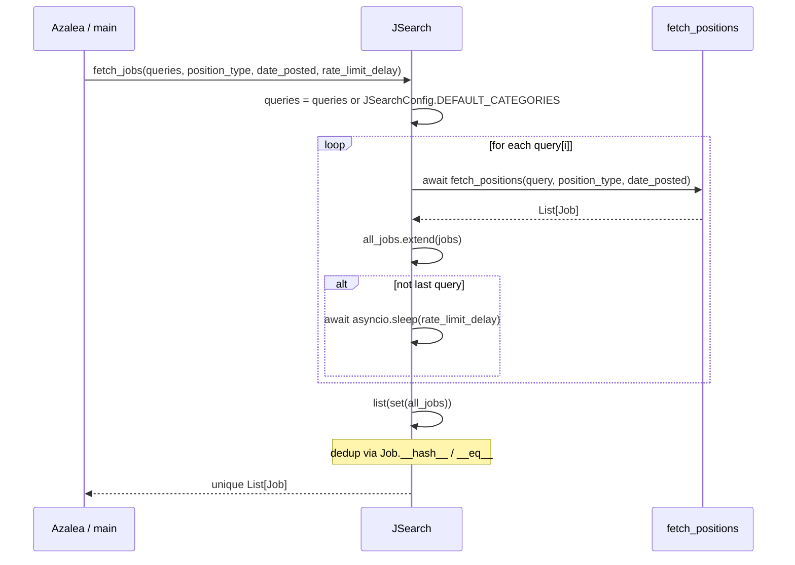
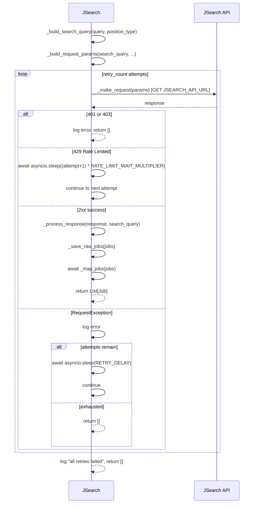
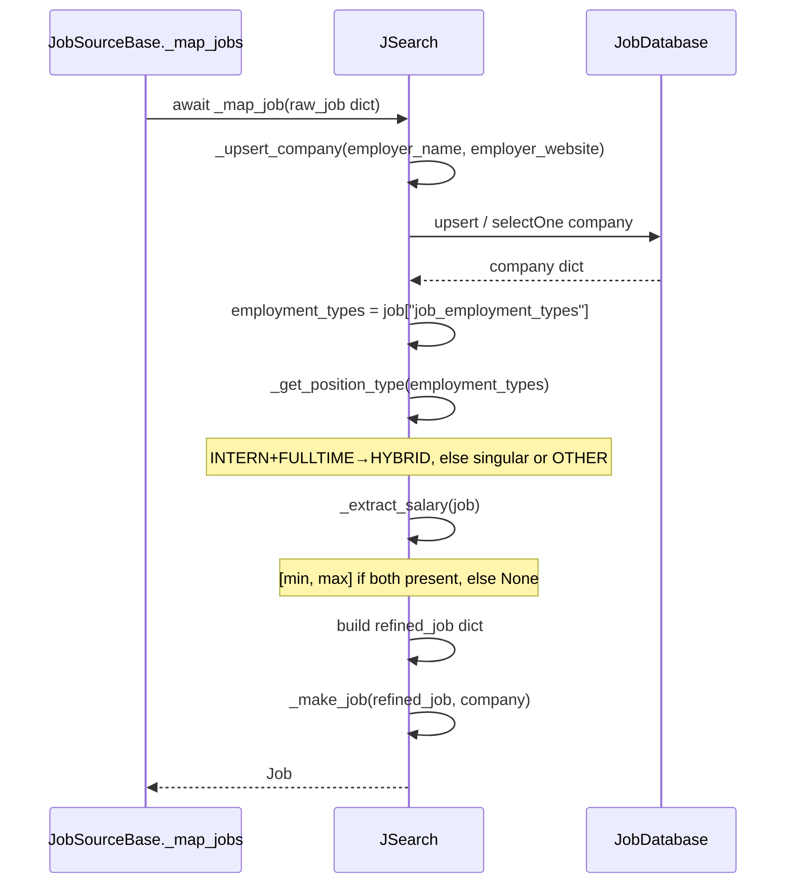

```mermaid
%% sequenceDiagram — fetch_jobs (multi-query loop with rate limiting)
sequenceDiagram
    participant Caller as Azalea / main
    participant JS as JSearch
    participant FP as fetch_positions

    Caller->>JS: fetch_jobs(queries, position_type, date_posted, rate_limit_delay)
    JS->>JS: queries = queries or JSearchConfig.DEFAULT_CATEGORIES

    loop for each query[i]
        JS->>FP: await fetch_positions(query, position_type, date_posted)
        FP-->>JS: List[Job]
        JS->>JS: all_jobs.extend(jobs)
        alt not last query
            JS->>JS: await asyncio.sleep(rate_limit_delay)
        end
    end

    JS->>JS: list(set(all_jobs))
    Note over JS: dedup via Job.__hash__ / __eq__
    JS-->>Caller: unique List[Job]
```

```mermaid
%% sequenceDiagram — fetch_positions (single page with retry logic)
sequenceDiagram
    participant JS as JSearch
    participant API as JSearch API

    JS->>JS: _build_search_query(query, position_type)
    JS->>JS: _build_request_params(search_query, ...)

    loop retry_count attempts
        JS->>API: _make_request(params) [GET JSEARCH_API_URL]
        API-->>JS: response

        alt 401 or 403
            JS-->>JS: log error, return []
        else 429 Rate Limited
            JS->>JS: await asyncio.sleep((attempt+1) * RATE_LIMIT_WAIT_MULTIPLIER)
            JS->>JS: continue to next attempt
        else 2xx success
            JS->>JS: _process_response(response, search_query)
            JS->>JS: _save_raw_jobs(jobs)
            JS->>JS: await _map_jobs(jobs)
            JS-->>JS: return List[Job]
        else RequestException
            JS->>JS: log error
            alt attempts remain
                JS->>JS: await asyncio.sleep(RETRY_DELAY)
                JS->>JS: continue
            else exhausted
                JS-->>JS: return []
            end
        end
    end

    JS-->>JS: log "all retries failed", return []

```

```mermaid
%% sequenceDiagram — _map_job (single raw dict → Job)
sequenceDiagram
    participant Base as JobSourceBase._map_jobs
    participant JS as JSearch
    participant DB as JobDatabase

    Base->>JS: await _map_job(raw_job dict)
    JS->>JS: _upsert_company(employer_name, employer_website)
    JS->>DB: upsert / selectOne company
    DB-->>JS: company dict

    JS->>JS: employment_types = job["job_employment_types"]
    JS->>JS: _get_position_type(employment_types)
    Note over JS: INTERN+FULLTIME→HYBRID, else singular or OTHER

    JS->>JS: _extract_salary(job)
    Note over JS: [min, max] if both present, else None

    JS->>JS: build refined_job dict
    JS->>JS: _make_job(refined_job, company)
    JS-->>Base: Job

```