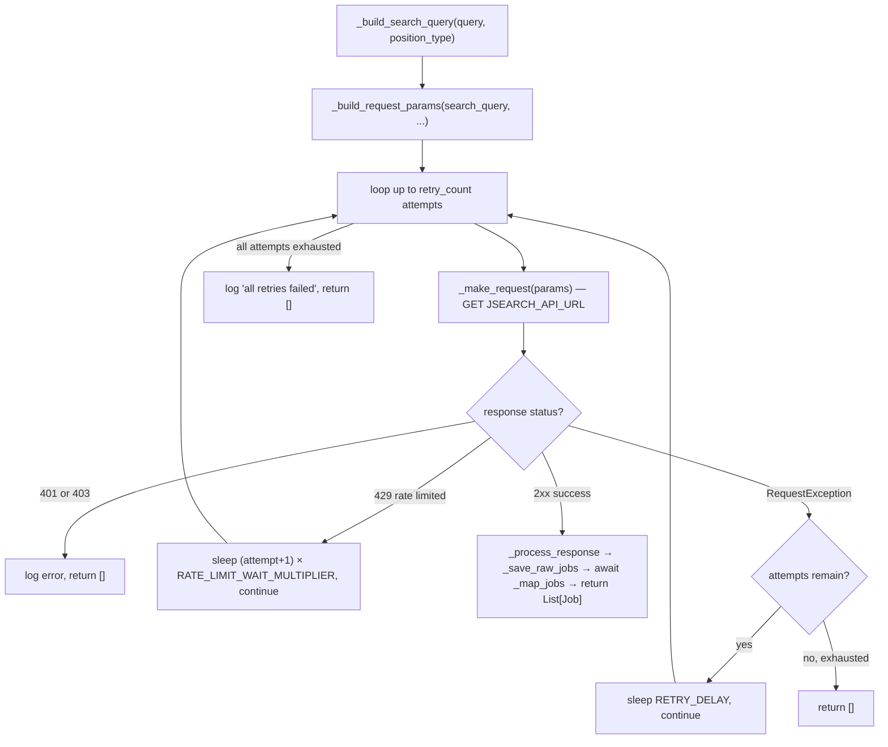
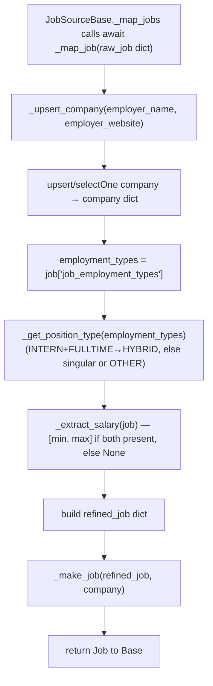

```mermaid
%% flowchart — fetch_jobs (multi-query loop with rate limiting)
flowchart TD
    A["Caller: fetch_jobs(queries, position_type, date_posted, rate_limit_delay)"] --> B["queries = queries or JSearchConfig.DEFAULT_CATEGORIES"]
    B --> C[loop for each query]
    C --> D["await fetch_positions(query, position_type, date_posted)"]
    D --> E["all_jobs.extend(jobs)"]
    E --> F{not last query?}
    F -->|yes| G["await asyncio.sleep(rate_limit_delay)"]
    G --> C
    F -->|no| H["list(set(all_jobs)) — dedup via Job.__hash__/__eq__"]
    H --> I[return unique List[Job] to Caller]
```




