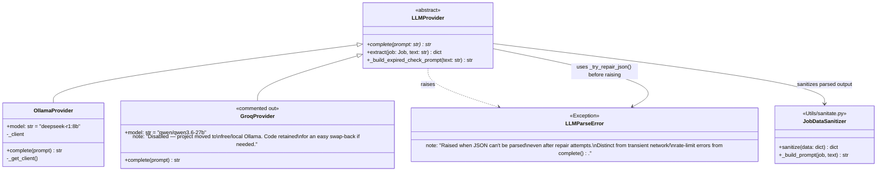

```mermaid
%% classDiagram — LLMProvider hierarchy, currently Ollama-only (Groq commented out)
classDiagram
    class LLMProvider {
        <<abstract>>
        +complete(prompt: str) str*
        +extract(job: Job, text: str) dict
        +_build_expired_check_prompt(text: str) str
    }

    class OllamaProvider {
        +model: str = "deepseek-r1:8b"
        -_client
        +complete(prompt) str
        -_get_client()
    }

    class GroqProvider {
        <<commented out>>
        +model: str = "qwen/qwen3.6-27b"
        +complete(prompt) str
        note: "Disabled — project moved to\nfree/local Ollama. Code retained\nfor an easy swap-back if needed."
    }

    class LLMParseError {
        <<Exception>>
        note: "Raised when JSON can't be parsed\neven after repair attempts.\nDistinct from transient network/\nrate-limit errors from complete()."
    }

    class JobDataSanitizer {
        <<Utils/sanitate.py>>
        +sanitize(data: dict) dict
        +_build_prompt(job, text) str
    }

    LLMProvider <|-- OllamaProvider
    LLMProvider <|-- GroqProvider
    LLMProvider ..> LLMParseError : raises
    LLMProvider --> JobDataSanitizer : sanitizes parsed output
    LLMProvider --> LLMParseError : uses _try_repair_json() before raising
```
