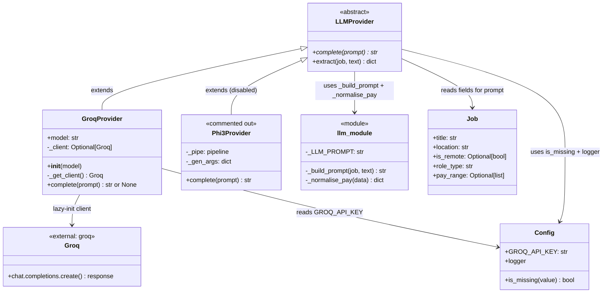

```mermaid
%% classDiagram — llm module: LLMProvider hierarchy and relationships
classDiagram
    class LLMProvider {
        <<abstract>>
        +complete(prompt) str*
        +extract(job, text) dict
    }

    class GroqProvider {
        +model: str
        -_client: Optional[Groq]
        +__init__(model)
        -_get_client() Groq
        +complete(prompt) str or None
    }

    class Phi3Provider {
        <<commented out>>
        -_pipe: pipeline
        -_gen_args: dict
        +complete(prompt) str
    }

    class llm_module {
        <<module>>
        -_LLM_PROMPT: str
        -_build_prompt(job, text) str
        -_normalise_pay(data) dict
    }

    class Job {
        +title: str
        +location: str
        +is_remote: Optional[bool]
        +role_type: str
        +pay_range: Optional[list]
    }

    class Config {
        +is_missing(value) bool
        +GROQ_API_KEY: str
        +logger
    }

    class Groq {
        <<external: groq>>
        +chat.completions.create() response
    }

    LLMProvider <|-- GroqProvider : extends
    LLMProvider <|-- Phi3Provider : extends (disabled)
    LLMProvider --> llm_module : uses _build_prompt + _normalise_pay
    LLMProvider --> Job : reads fields for prompt
    LLMProvider --> Config : uses is_missing + logger
    GroqProvider --> Groq : lazy-init client
    GroqProvider --> Config : reads GROQ_API_KEY

```