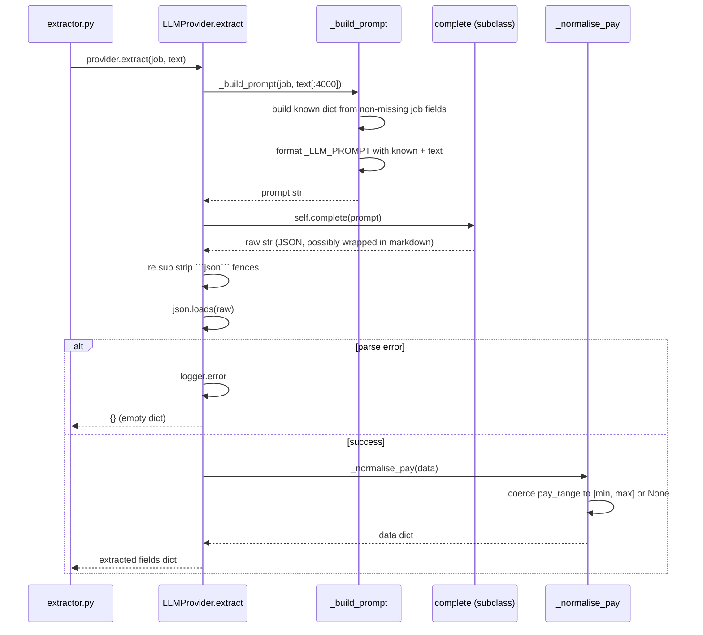
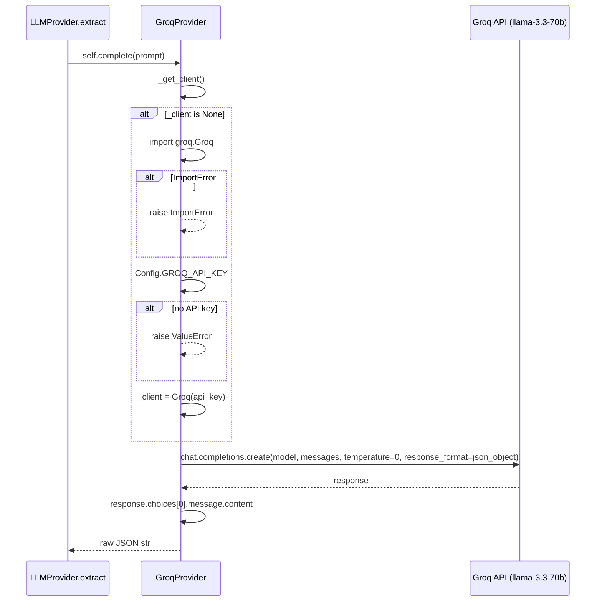

```mermaid
%% sequenceDiagram — LLMProvider.extract (prompt → parse → normalize)
sequenceDiagram
    participant Caller as extractor.py
    participant P as LLMProvider.extract
    participant BP as _build_prompt
    participant Sub as complete (subclass)
    participant NP as _normalise_pay

    Caller->>P: provider.extract(job, text)
    P->>BP: _build_prompt(job, text[:4000])
    BP->>BP: build known dict from non-missing job fields
    BP->>BP: format _LLM_PROMPT with known + text
    BP-->>P: prompt str

    P->>Sub: self.complete(prompt)
    Sub-->>P: raw str (JSON, possibly wrapped in markdown)

    P->>P: re.sub strip ```json``` fences
    P->>P: json.loads(raw)

    alt parse error
        P->>P: logger.error
        P-->>Caller: {} (empty dict)
    else success
        P->>NP: _normalise_pay(data)
        NP->>NP: coerce pay_range to [min, max] or None
        NP-->>P: data dict
        P-->>Caller: extracted fields dict
    end

```
# sequenceDiagram — GroqProvider.complete (lazy-init → API call)

```mermaid
%% sequenceDiagram — GroqProvider.complete (lazy-init → API call)
sequenceDiagram
    participant P as LLMProvider.extract
    participant G as GroqProvider
    participant API as Groq API (llama-3.3-70b)

    P->>G: self.complete(prompt)
    G->>G: _get_client()

    alt _client is None
        G->>G: import groq.Groq
        alt ImportError
            G-->>G: raise ImportError
        end
        G->>G: Config.GROQ_API_KEY
        alt no API key
            G-->>G: raise ValueError
        end
        G->>G: _client = Groq(api_key)
    end

    G->>API: chat.completions.create(model, messages, temperature=0, response_format=json_object)
    API-->>G: response
    G->>G: response.choices[0].message.content
    G-->>P: raw JSON str

```