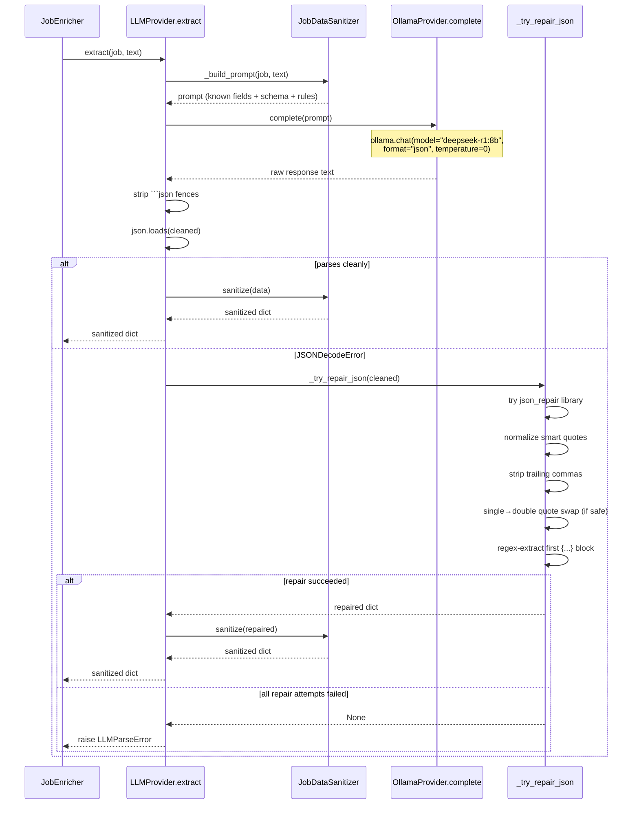

```mermaid
%% sequenceDiagram — LLMProvider.extract() with JSON repair pipeline
sequenceDiagram
    participant Caller as JobEnricher
    participant LP as LLMProvider.extract
    participant San as JobDataSanitizer
    participant Ollama as OllamaProvider.complete
    participant Repair as _try_repair_json

    Caller->>LP: extract(job, text)
    LP->>San: _build_prompt(job, text)
    San-->>LP: prompt (known fields + schema + rules)
    LP->>Ollama: complete(prompt)
    Note over Ollama: ollama.chat(model="deepseek-r1:8b",<br/>format="json", temperature=0)
    Ollama-->>LP: raw response text
    LP->>LP: strip ```json fences

    LP->>LP: json.loads(cleaned)
    alt parses cleanly
        LP->>San: sanitize(data)
        San-->>LP: sanitized dict
        LP-->>Caller: sanitized dict
    else JSONDecodeError
        LP->>Repair: _try_repair_json(cleaned)
        Repair->>Repair: try json_repair library
        Repair->>Repair: normalize smart quotes
        Repair->>Repair: strip trailing commas
        Repair->>Repair: single→double quote swap (if safe)
        Repair->>Repair: regex-extract first {...} block
        alt repair succeeded
            Repair-->>LP: repaired dict
            LP->>San: sanitize(repaired)
            San-->>LP: sanitized dict
            LP-->>Caller: sanitized dict
        else all repair attempts failed
            Repair-->>LP: None
            LP-->>Caller: raise LLMParseError
        end
    end
```
