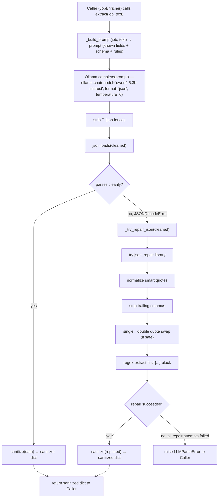

```mermaid
%% flowchart — LLMProvider.extract() with JSON repair pipeline
flowchart TD
    A["Caller (JobEnricher) calls extract(job, text)"] --> B["_build_prompt(job, text) → prompt (known fields + schema + rules)"]
    B --> C["Ollama.complete(prompt) —<br/>ollama.chat(model='qwen2.5:3b-instruct', format='json', temperature=0)"]
    C --> D["strip ```json fences"]
    D --> E["json.loads(cleaned)"]
    E --> F{parses cleanly?}
    F -->|yes| G["sanitize(data) → sanitized dict"]
    G --> H[return sanitized dict to Caller]
    F -->|no, JSONDecodeError| I["_try_repair_json(cleaned)"]
    I --> J[try json_repair library]
    J --> K[normalize smart quotes]
    K --> L[strip trailing commas]
    L --> M["single→double quote swap (if safe)"]
    M --> N["regex-extract first {...} block"]
    N --> O{repair succeeded?}
    O -->|yes| P["sanitize(repaired) → sanitized dict"]
    P --> H
    O -->|no, all repair attempts failed| Q["raise LLMParseError to Caller"]
```
