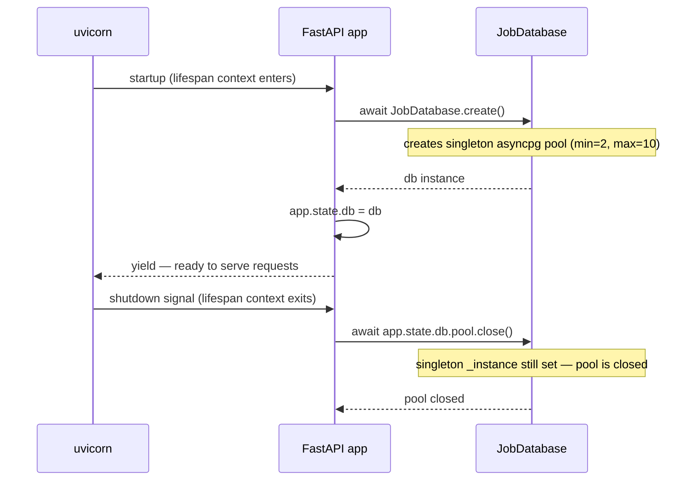
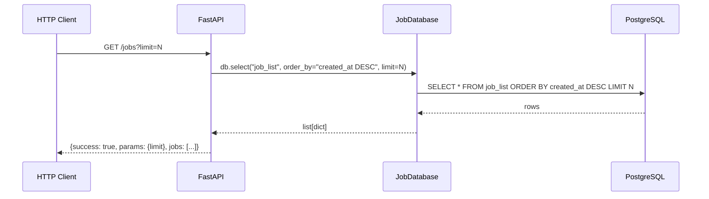
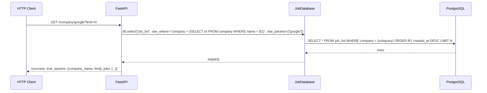
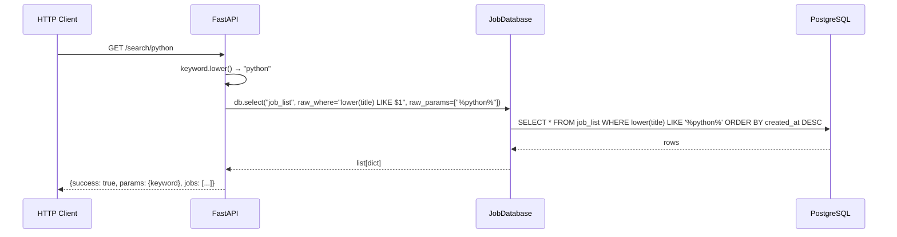
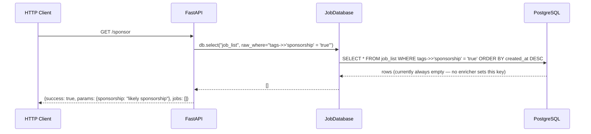
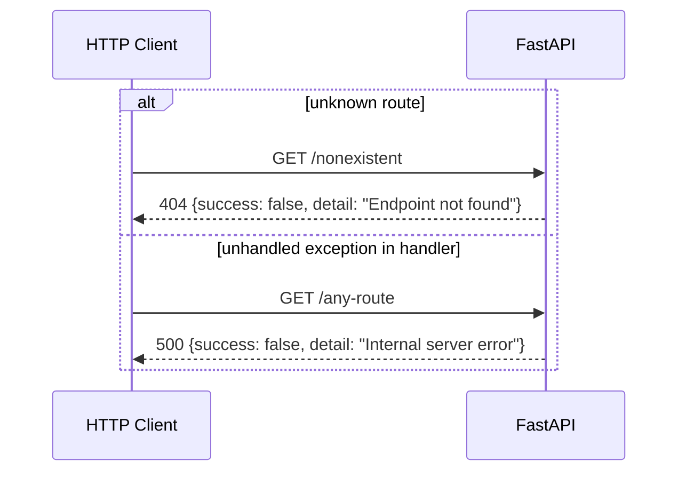

```mermaid
%% sequenceDiagram — FastAPI lifespan: startup and shutdown
%% NOTE: file named main_flask_seq.md for historical reasons — this is FastAPI, not Flask
sequenceDiagram
    participant UV as uvicorn
    participant App as FastAPI app
    participant DB as JobDatabase

    UV->>App: startup (lifespan context enters)
    App->>DB: await JobDatabase.create()
    Note over DB: creates singleton asyncpg pool (min=2, max=10)
    DB-->>App: db instance
    App->>App: app.state.db = db
    App-->>UV: yield — ready to serve requests

    UV->>App: shutdown signal (lifespan context exits)
    App->>DB: await app.state.db.pool.close()
    Note over DB: singleton _instance still set — pool is closed
    DB-->>App: pool closed
```

```mermaid
%% sequenceDiagram — GET /jobs (all jobs, optional limit)
sequenceDiagram
    participant Client as HTTP Client
    participant App as FastAPI
    participant DB as JobDatabase
    participant PG as PostgreSQL

    Client->>App: GET /jobs?limit=N
    App->>DB: db.select("job_list", order_by="created_at DESC", limit=N)
    DB->>PG: SELECT * FROM job_list ORDER BY created_at DESC LIMIT N
    PG-->>DB: rows
    DB-->>App: list[dict]
    App-->>Client: {success: true, params: {limit}, jobs: [...]}
```

```mermaid
%% sequenceDiagram — GET /company/{company_name} (jobs by company)
sequenceDiagram
    participant Client as HTTP Client
    participant App as FastAPI
    participant DB as JobDatabase
    participant PG as PostgreSQL

    Client->>App: GET /company/google?limit=N
    App->>DB: db.select("job_list", raw_where="company = (SELECT id FROM company WHERE name = $1)", raw_params=["google"])
    DB->>PG: SELECT * FROM job_list WHERE company = (subquery) ORDER BY created_at DESC LIMIT N
    PG-->>DB: rows
    DB-->>App: list[dict]
    App-->>Client: {success: true, params: {company_name, limit}, jobs: [...]}
```

```mermaid
%% sequenceDiagram — GET /search/{keyword} (title keyword search)
sequenceDiagram
    participant Client as HTTP Client
    participant App as FastAPI
    participant DB as JobDatabase
    participant PG as PostgreSQL

    Client->>App: GET /search/python
    App->>App: keyword.lower() → "python"
    App->>DB: db.select("job_list", raw_where="lower(title) LIKE $1", raw_params=["%python%"])
    DB->>PG: SELECT * FROM job_list WHERE lower(title) LIKE '%python%' ORDER BY created_at DESC
    PG-->>DB: rows
    DB-->>App: list[dict]
    App-->>Client: {success: true, params: {keyword}, jobs: [...]}
```

```mermaid
%% sequenceDiagram — GET /sponsor (sponsorship tag filter)
%% BUG: tags->>'sponsorship' is never set by the enrichment pipeline.
%% The LLM prompt populates skill_0..N and experience_years, not a sponsorship key.
%% This endpoint will always return an empty list until the enrichment tags schema is updated.
sequenceDiagram
    participant Client as HTTP Client
    participant App as FastAPI
    participant DB as JobDatabase
    participant PG as PostgreSQL

    Client->>App: GET /sponsor
    App->>DB: db.select("job_list", raw_where="tags->>'sponsorship' = 'true'")
    DB->>PG: SELECT * FROM job_list WHERE tags->>'sponsorship' = 'true' ORDER BY created_at DESC
    PG-->>DB: rows (currently always empty — no enricher sets this key)
    DB-->>App: []
    App-->>Client: {success: true, params: {sponsorship: "likely sponsorship"}, jobs: []}
```

```mermaid
%% sequenceDiagram — error handlers (404 / 500)
sequenceDiagram
    participant Client as HTTP Client
    participant App as FastAPI

    alt unknown route
        Client->>App: GET /nonexistent
        App-->>Client: 404 {success: false, detail: "Endpoint not found"}
    else unhandled exception in handler
        Client->>App: GET /any-route
        App-->>Client: 500 {success: false, detail: "Internal server error"}
    end
```