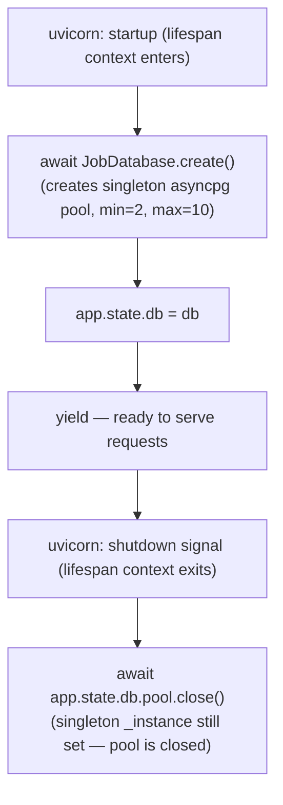
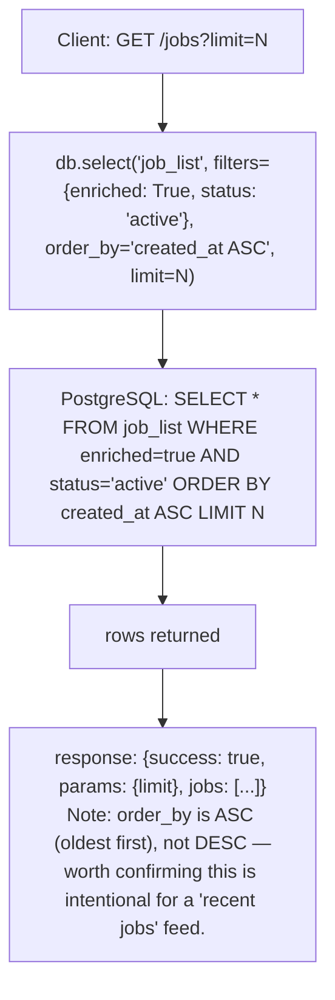
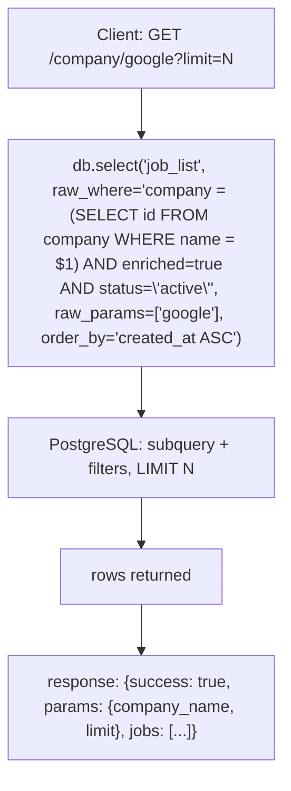
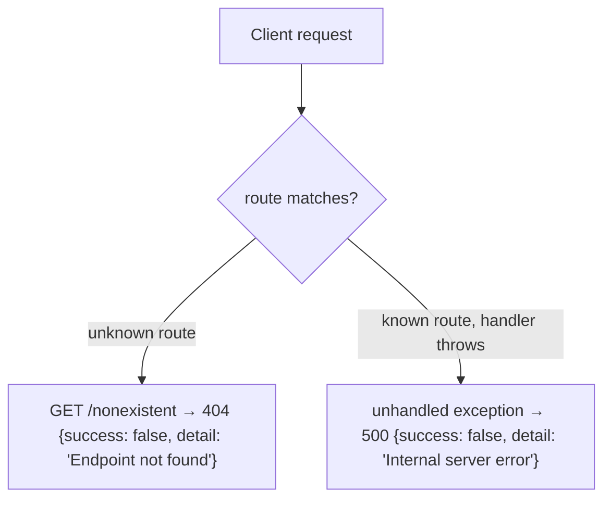

```mermaid
%% flowchart — GET /search/{keyword} (title keyword search)
flowchart TD
    A["Client: GET /search/python"] --> B["keyword.lower() → 'python'"]
    B --> C["db.select('job_list', raw_where=\"lower(title) LIKE $1 AND enriched=true AND status='active'\", raw_params=['%python%'], order_by='created_at ASC')"]
    C --> D["PostgreSQL: LIKE query, NO LIMIT applied"]
    D --> E[rows returned]
    E --> F["response: {success: true, params: {keyword}, jobs: [...]}<br/>Note: no limit param on this route — a common keyword<br/>could return the entire active, enriched table."]
```

```mermaid
%% flowchart — GET /sponsor (sponsorship tag filter)
%% BUG: tags->>'sponsorship' is never set by the enrichment pipeline.
%% The LLM prompt populates skill_0..N and experience_years, not a sponsorship key.
%% This endpoint will always return an empty list until the enrichment tags schema is updated.
flowchart TD
    A["Client: GET /sponsor"] --> B["db.select('job_list', raw_where=\"tags->>'sponsorship' = 'true' AND enriched=true AND status='active'\", order_by='created_at DESC')"]
    B --> C["PostgreSQL executes query"]
    C --> D["rows — currently ALWAYS empty (no enricher sets this key)"]
    D --> E["response: {success: true, params: {sponsorship: 'likely sponsorship'}, jobs: []}"]
```


