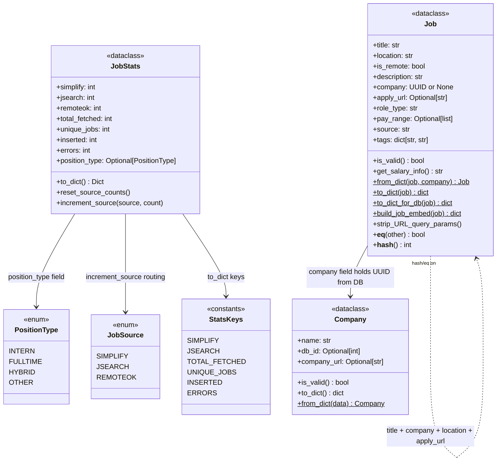

```mermaid
%% classDiagram — models.py: Job, Company, JobStats
classDiagram
    class Job {
        <<dataclass>>
        +title: str
        +location: str
        +is_remote: bool
        +description: str
        +company: UUID or None
        +apply_url: Optional[str]
        +role_type: str
        +pay_range: Optional[list]
        +source: str
        +tags: dict[str, str]
        +is_valid() bool
        +get_salary_info() str
        +from_dict(job, company) Job$
        +to_dict(job) dict$
        +to_dict_for_db(job) dict$
        +build_job_embed(job) dict$
        +strip_URL_query_params()
        +__eq__(other) bool
        +__hash__() int
    }

    class Company {
        <<dataclass>>
        +name: str
        +db_id: Optional[int]
        +company_url: Optional[str]
        +is_valid() bool
        +to_dict() dict
        +from_dict(data) Company$
    }

    class JobStats {
        <<dataclass>>
        +simplify: int
        +jsearch: int
        +remoteok: int
        +total_fetched: int
        +unique_jobs: int
        +inserted: int
        +errors: int
        +position_type: Optional[PositionType]
        +to_dict() Dict
        +reset_source_counts()
        +increment_source(source, count)
    }

    class PositionType {
        <<enum>>
        INTERN
        FULLTIME
        HYBRID
        OTHER
    }

    class JobSource {
        <<enum>>
        SIMPLIFY
        JSEARCH
        REMOTEOK
    }

    class StatsKeys {
        <<constants>>
        SIMPLIFY
        JSEARCH
        TOTAL_FETCHED
        UNIQUE_JOBS
        INSERTED
        ERRORS
    }

    Job --> Company : company field holds UUID from DB
    JobStats --> PositionType : position_type field
    JobStats --> JobSource : increment_source routing
    JobStats --> StatsKeys : to_dict keys
    Job "hash/eq on" ..> Job : title + company + location + apply_url

```