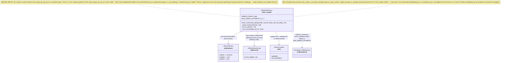

```mermaid
%% classDiagram — refine.py module-level batch enrichment (no class, but shown as a unit)
classDiagram
    class refine_module {
        <<Refine/refine.py>>
        +ENRICH_FIELDS: tuple
        +MAX_ENRICH_ATTEMPTS: int = 3
        +enrich_unenriched_jobs(provider, use_llm, batch_size, llm_delay) dict
        -_needs_enrichment(row) bool
        -_row_to_job(row) Job
        -_mark_enriched(db, job_id) None
    }

    class JobEnricher {
        <<Refine/extractor.py>>
        +enrich_job(job) dict
    }

    class JobDatabase {
        <<Service/db.py>>
        +select(...) list~dict~
        +update(...) dict
        +upsert(...) dict
    }

    class LLMParseError {
        <<Exception, Refine/llm.py>>
    }

    class tqdm {
        <<external: tqdm>>
        +update(1)
        +set_postfix(dict)
    }

    refine_module --> JobDatabase : pull unenriched batch, persist results
    refine_module --> JobEnricher : "new instance created PER JOB\n(meta dict isn't reset between calls)"
    refine_module --> tqdm : progress bar + background 1s refresh thread
    refine_module ..> LLMParseError : catches, increments enrich_attempts,\ncaps retries at MAX_ENRICH_ATTEMPTS

    note for refine_module "BROKEN IMPORT: the module currently has\n'from the import get_job_by_id' at module\nscope. There is no 'the' module anywhere in\nthis repo and get_job_by_id is never called —\nthis raises ModuleNotFoundError the instant\nrefine.py (or anything that imports it, e.g.\nazalea.py / Tasks/enrich.py) is loaded. This\nis a regression versus the previously-fixed\nimport bug documented in Roadmap — needs a\nfollow-up fix (delete the line)."

    note for refine_module "RAG example-bank promotion (too_similar_to_existing_example,\npasses_sanity_checks, maybe_promote_to_example_bank) has\nmoved OUT of this module entirely — it now lives in the new\nTasks/embeddings.py as a standalone pass, decoupled from\nenrichment so a slow first Ollama embedding call never\nblocks enrichment throughput."
```