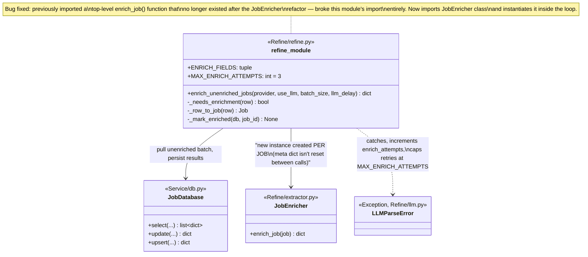

```mermaid
%% classDiagram — refine.py module-level batch enrichment (no class, but shown as a unit)
classDiagram
    class refine_module {
        <<Refine/refine.py>>
        +ENRICH_FIELDS: tuple
        +MAX_ENRICH_ATTEMPTS: int = 3
        +enrich_unenriched_jobs(provider, use_llm, batch_size, llm_delay) dict
        -_needs_enrichment(row) bool
        -_row_to_job(row) Job
        -_mark_enriched(db, job_id) None
    }

    class JobEnricher {
        <<Refine/extractor.py>>
        +enrich_job(job) dict
    }

    class JobDatabase {
        <<Service/db.py>>
        +select(...) list~dict~
        +update(...) dict
        +upsert(...) dict
    }

    class LLMParseError {
        <<Exception, Refine/llm.py>>
    }

    refine_module --> JobDatabase : pull unenriched batch, persist results
    refine_module --> JobEnricher : "new instance created PER JOB\n(meta dict isn't reset between calls)"
    refine_module ..> LLMParseError : catches, increments enrich_attempts,\ncaps retries at MAX_ENRICH_ATTEMPTS

    note for refine_module "Bug fixed: previously imported a\ntop-level enrich_job() function that\nno longer existed after the JobEnricher\nrefactor — broke this module's import\nentirely. Now imports JobEnricher class\nand instantiates it inside the loop."
```
