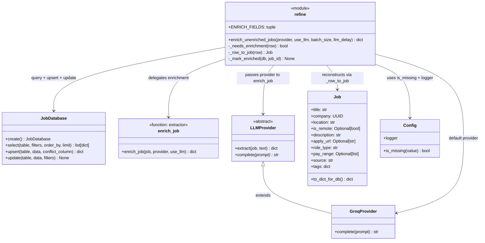

```mermaid
%% classDiagram — refine module functions and relationships
classDiagram
    class refine {
        <<module>>
        +ENRICH_FIELDS: tuple
        +enrich_unenriched_jobs(provider, use_llm, batch_size, llm_delay) dict
        -_needs_enrichment(row) bool
        -_row_to_job(row) Job
        -_mark_enriched(db, job_id) None
    }

    class JobDatabase {
        +create() JobDatabase
        +select(table, filters, order_by, limit) list[dict]
        +upsert(table, data, conflict_column) dict
        +update(table, data, filters) None
    }

    class enrich_job {
        <<function: extractor>>
        +enrich_job(job, provider, use_llm) dict
    }

    class LLMProvider {
        <<abstract>>
        +extract(job, text) dict
        +complete(prompt) str*
    }

    class GroqProvider {
        +complete(prompt) str
    }

    class Job {
        +title: str
        +company: UUID
        +location: str
        +is_remote: Optional[bool]
        +description: str
        +apply_url: Optional[str]
        +role_type: str
        +pay_range: Optional[list]
        +source: str
        +tags: dict
        +to_dict_for_db() dict
    }

    class Config {
        +is_missing(value) bool
        +logger
    }

    LLMProvider <|-- GroqProvider : extends
    refine --> JobDatabase : query + upsert + update
    refine --> enrich_job : delegates enrichment
    refine --> LLMProvider : passes provider to enrich_job
    refine --> GroqProvider : default provider
    refine --> Job : reconstructs via _row_to_job
    refine --> Config : uses is_missing + logger

```