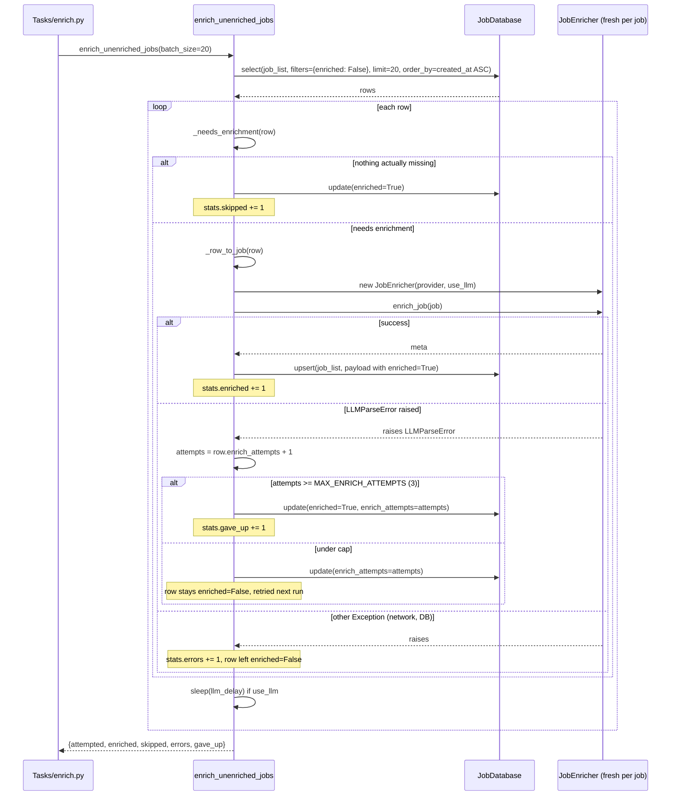

```mermaid
%% sequenceDiagram — enrich_unenriched_jobs() batch loop
sequenceDiagram
    participant Task as Tasks/enrich.py
    participant Ref as enrich_unenriched_jobs
    participant DB as JobDatabase
    participant JE as JobEnricher (fresh per job)

    Task->>Ref: enrich_unenriched_jobs(batch_size=20)
    Ref->>DB: select(job_list, filters={enriched: False}, limit=20, order_by=created_at ASC)
    DB-->>Ref: rows

    loop each row
        Ref->>Ref: _needs_enrichment(row)
        alt nothing actually missing
            Ref->>DB: update(enriched=True)
            Note over Ref: stats.skipped += 1
        else needs enrichment
            Ref->>Ref: _row_to_job(row)
            Ref->>JE: new JobEnricher(provider, use_llm)
            Ref->>JE: enrich_job(job)

            alt success
                JE-->>Ref: meta
                Ref->>DB: upsert(job_list, payload with enriched=True)
                Note over Ref: stats.enriched += 1
            else LLMParseError raised
                JE-->>Ref: raises LLMParseError
                Ref->>Ref: attempts = row.enrich_attempts + 1
                alt attempts >= MAX_ENRICH_ATTEMPTS (3)
                    Ref->>DB: update(enriched=True, enrich_attempts=attempts)
                    Note over Ref: stats.gave_up += 1
                else under cap
                    Ref->>DB: update(enrich_attempts=attempts)
                    Note over Ref: row stays enriched=False, retried next run
                end
            else other Exception (network, DB)
                JE-->>Ref: raises
                Note over Ref: stats.errors += 1, row left enriched=False
            end
        end
        Ref->>Ref: sleep(llm_delay) if use_llm
    end

    Ref-->>Task: {attempted, enriched, skipped, errors, gave_up}
```
