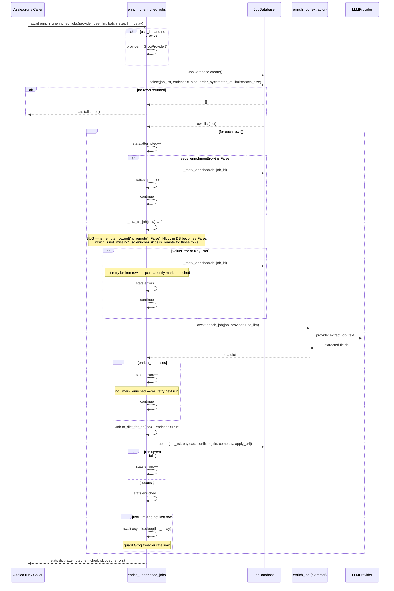
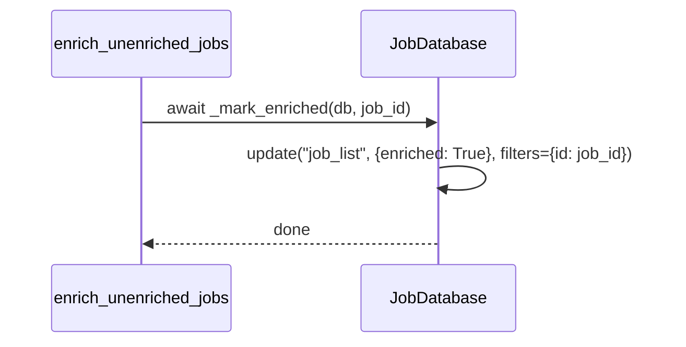

```mermaid
%% sequenceDiagram — enrich_unenriched_jobs (DB fetch → enrich batch → persist)
sequenceDiagram
    participant Az as Azalea.run / Caller
    participant R as enrich_unenriched_jobs
    participant DB as JobDatabase
    participant EJ as enrich_job (extractor)
    participant LLM as LLMProvider

    Az->>R: await enrich_unenriched_jobs(provider, use_llm, batch_size, llm_delay)

    alt use_llm and no provider
        R->>R: provider = GroqProvider()
    end

    R->>DB: JobDatabase.create()
    R->>DB: select(job_list, enriched=False, order_by=created_at, limit=batch_size)

    alt no rows returned
        DB-->>R: []
        R-->>Az: stats (all zeros)
    end

    DB-->>R: rows list[dict]

    loop for each row[i]
        R->>R: stats.attempted++

        alt _needs_enrichment(row) is False
            R->>DB: _mark_enriched(db, job_id)
            R->>R: stats.skipped++
            R->>R: continue
        end

        R->>R: _row_to_job(row) → Job
        Note over R: BUG — is_remote=row.get("is_remote", False): NULL in DB becomes False,<br/>which is not "missing", so enricher skips is_remote for those rows
        alt ValueError or KeyError
            R->>DB: _mark_enriched(db, job_id)
            Note over R: don't retry broken rows — permanently marks enriched
            R->>R: stats.errors++
            R->>R: continue
        end

        R->>EJ: await enrich_job(job, provider, use_llm)
        EJ->>LLM: provider.extract(job, text)
        LLM-->>EJ: extracted fields
        EJ-->>R: meta dict

        alt enrich_job raises
            R->>R: stats.errors++
            Note over R: no _mark_enriched — will retry next run
            R->>R: continue
        end

        R->>R: Job.to_dict_for_db(job) + enriched=True
        R->>DB: upsert(job_list, payload, conflict=[title, company, apply_url])

        alt DB upsert fails
            R->>R: stats.errors++
        else success
            R->>R: stats.enriched++
        end

        alt use_llm and not last row
            R->>R: await asyncio.sleep(llm_delay)
            Note over R: guard Groq free-tier rate limit
        end
    end

    R-->>Az: stats dict {attempted, enriched, skipped, errors}

```

```mermaid
%% sequenceDiagram — _mark_enriched (minimal DB update)
sequenceDiagram
    participant R as enrich_unenriched_jobs
    participant DB as JobDatabase

    R->>DB: await _mark_enriched(db, job_id)
    DB->>DB: update("job_list", {enriched: True}, filters={id: job_id})
    DB-->>R: done

```