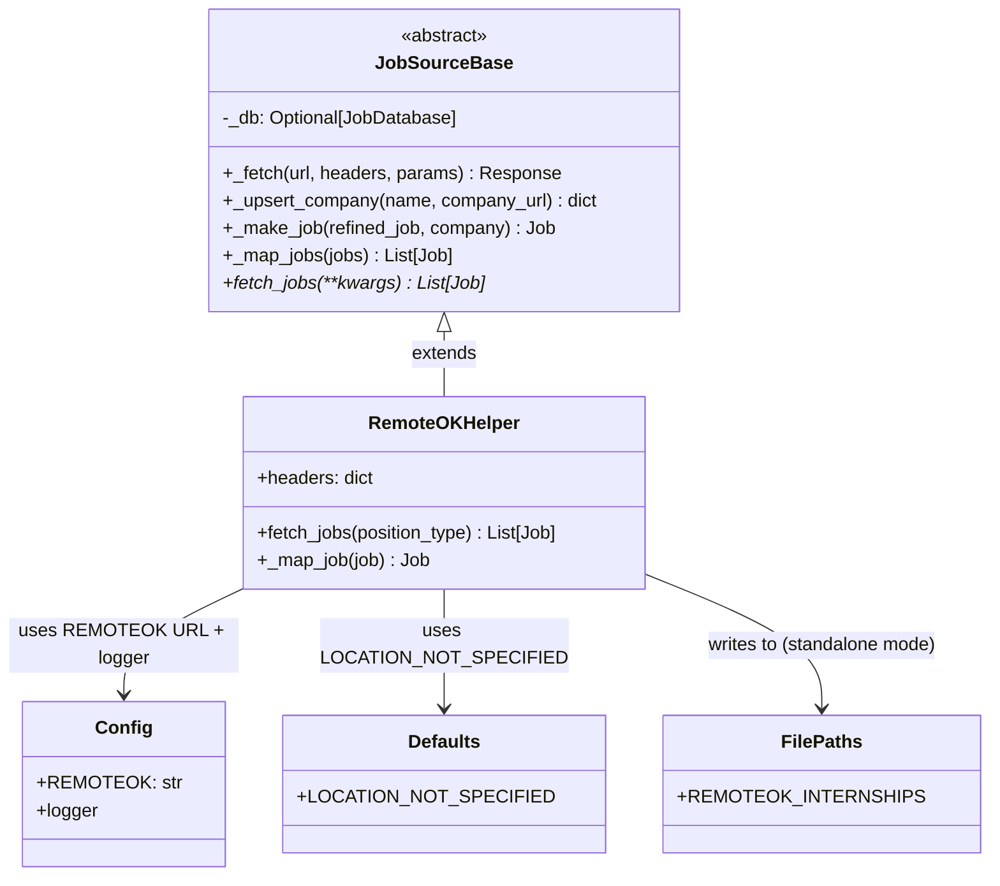

```mermaid
%% classDiagram — RemoteOKHelper structure and relationships
classDiagram
    class RemoteOKHelper {
        +headers: dict
        +fetch_jobs(position_type) List[Job]
        +_map_job(job) Job
    }

    class JobSourceBase {
        <<abstract>>
        -_db: Optional[JobDatabase]
        +_fetch(url, headers, params) Response
        +_upsert_company(name, company_url) dict
        +_make_job(refined_job, company) Job
        +_map_jobs(jobs) List[Job]
        +fetch_jobs(**kwargs) List[Job]*
    }

    class Config {
        +REMOTEOK: str
        +logger
    }

    class Defaults {
        +LOCATION_NOT_SPECIFIED
    }

    class FilePaths {
        +REMOTEOK_INTERNSHIPS
    }

    JobSourceBase <|-- RemoteOKHelper : extends
    RemoteOKHelper --> Config : uses REMOTEOK URL + logger
    RemoteOKHelper --> Defaults : uses LOCATION_NOT_SPECIFIED
    RemoteOKHelper --> FilePaths : writes to (standalone mode)

```