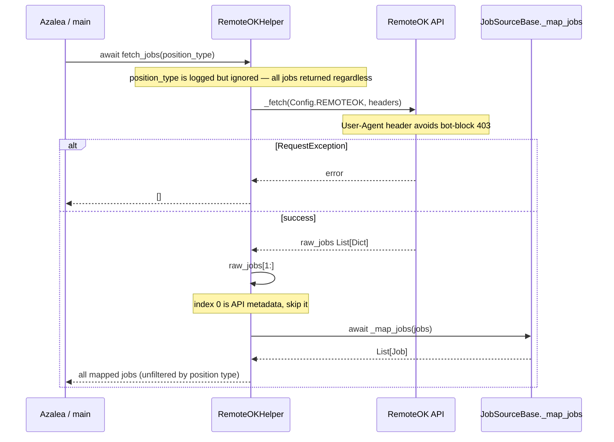
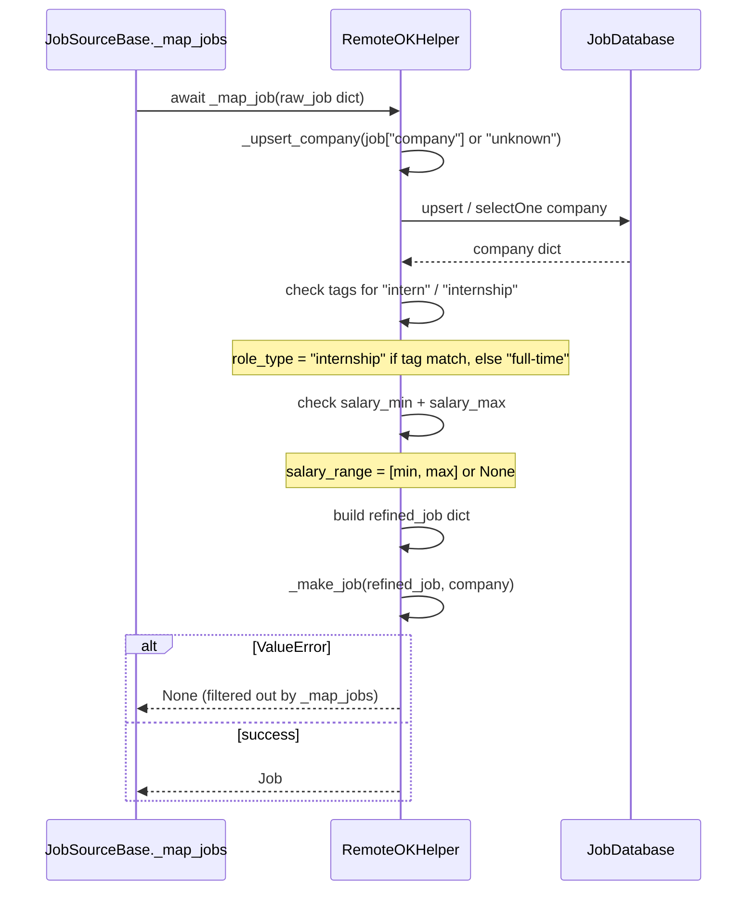

```mermaid
%% sequenceDiagram — fetch_jobs (fetch, strip metadata, map)
%% BUG: position_type parameter is accepted but never used for filtering.
%% RemoteOK API has no type filter; _map_job infers role_type from tags only.
%% fetch_from_source also calls helper.fetch_jobs() with no args (case _),
%% so position_type is dropped before it even reaches this method.
sequenceDiagram
    participant Caller as Azalea / main
    participant RO as RemoteOKHelper
    participant API as RemoteOK API
    participant Base as JobSourceBase._map_jobs

    Caller->>RO: await fetch_jobs(position_type)
    Note over RO: position_type is logged but ignored — all jobs returned regardless
    RO->>API: _fetch(Config.REMOTEOK, headers)
    Note over API: User-Agent header avoids bot-block 403

    alt RequestException
        API-->>RO: error
        RO-->>Caller: []
    else success
        API-->>RO: raw_jobs List[Dict]
        RO->>RO: raw_jobs[1:]
        Note over RO: index 0 is API metadata, skip it
        RO->>Base: await _map_jobs(jobs)
        Base-->>RO: List[Job]
        RO-->>Caller: all mapped jobs (unfiltered by position type)
    end
```

```mermaid

%% sequenceDiagram — _map_job (single raw dict → Job)
sequenceDiagram
    participant Base as JobSourceBase._map_jobs
    participant RO as RemoteOKHelper
    participant DB as JobDatabase

    Base->>RO: await _map_job(raw_job dict)
    RO->>RO: _upsert_company(job["company"] or "unknown")
    RO->>DB: upsert / selectOne company
    DB-->>RO: company dict

    RO->>RO: check tags for "intern" / "internship"
    Note over RO: role_type = "internship" if tag match, else "full-time"

    RO->>RO: check salary_min + salary_max
    Note over RO: salary_range = [min, max] or None

    RO->>RO: build refined_job dict
    RO->>RO: _make_job(refined_job, company)

    alt ValueError
        RO-->>Base: None (filtered out by _map_jobs)
    else success
        RO-->>Base: Job
    end

```