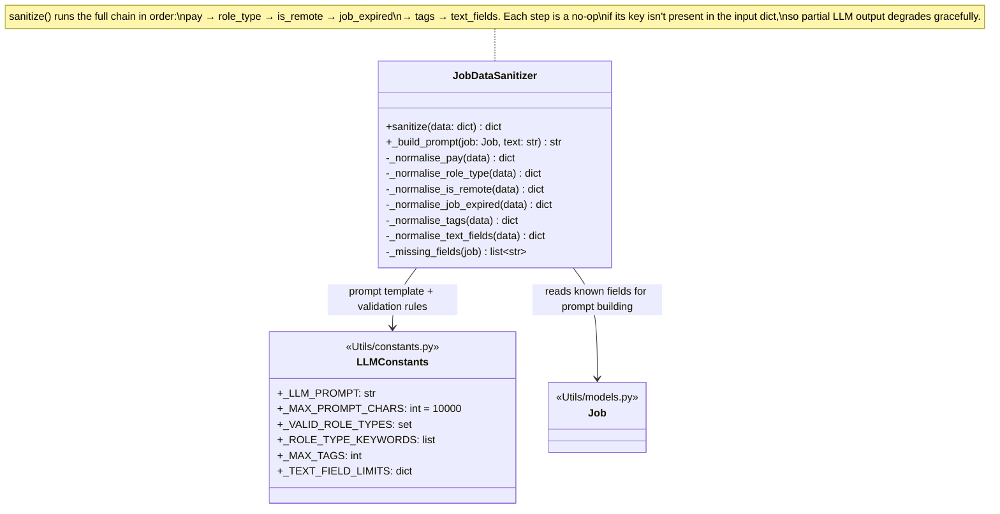

```mermaid
%% classDiagram — JobDataSanitizer (Utils/sanitate.py) - new module, no prior diagram
classDiagram
    class JobDataSanitizer {
        +sanitize(data: dict) dict
        +_build_prompt(job: Job, text: str) str
        -_normalise_pay(data) dict
        -_normalise_role_type(data) dict
        -_normalise_is_remote(data) dict
        -_normalise_job_expired(data) dict
        -_normalise_tags(data) dict
        -_normalise_text_fields(data) dict
        -_missing_fields(job) list~str~
    }

    class LLMConstants {
        <<Utils/constants.py>>
        +_LLM_PROMPT: str
        +_MAX_PROMPT_CHARS: int = 10000
        +_VALID_ROLE_TYPES: set
        +_ROLE_TYPE_KEYWORDS: list
        +_MAX_TAGS: int
        +_TEXT_FIELD_LIMITS: dict
    }

    class Job {
        <<Utils/models.py>>
    }

    JobDataSanitizer --> LLMConstants : prompt template + validation rules
    JobDataSanitizer --> Job : reads known fields for prompt building

    note for JobDataSanitizer "sanitize() runs the full chain in order:\npay → role_type → is_remote → job_expired\n→ tags → text_fields. Each step is a no-op\nif its key isn't present in the input dict,\nso partial LLM output degrades gracefully."
```
