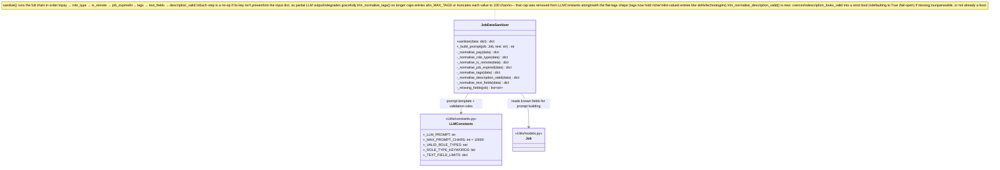

```mermaid
%% classDiagram — JobDataSanitizer (Utils/sanitate.py)
classDiagram
    class JobDataSanitizer {
        +sanitize(data: dict) dict
        +_build_prompt(job: Job, text: str) str
        -_normalise_pay(data) dict
        -_normalise_role_type(data) dict
        -_normalise_is_remote(data) dict
        -_normalise_job_expired(data) dict
        -_normalise_tags(data) dict
        -_normalise_description_valid(data) dict
        -_normalise_text_fields(data) dict
        -_missing_fields(job) list~str~
    }

    class LLMConstants {
        <<Utils/constants.py>>
        +_LLM_PROMPT: str
        +_MAX_PROMPT_CHARS: int = 10000
        +_VALID_ROLE_TYPES: set
        +_ROLE_TYPE_KEYWORDS: list
        +_TEXT_FIELD_LIMITS: dict
    }

    class Job {
        <<Utils/models.py>>
    }

    JobDataSanitizer --> LLMConstants : prompt template + validation rules
    JobDataSanitizer --> Job : reads known fields for prompt building

    note for JobDataSanitizer "sanitize() runs the full chain in order:\npay → role_type → is_remote → job_expired\n→ tags → text_fields → description_valid.\nEach step is a no-op if its key isn't present\nin the input dict, so partial LLM output\ndegrades gracefully.\n\n_normalise_tags() no longer caps entries at\n_MAX_TAGS or truncates each value to 100 chars\n— that cap was removed from LLMConstants along\nwith the flat-tags shape (tags now hold richer\nlist-valued entries like skills/technologies).\n\n_normalise_description_valid() is new: coerces\ndescription_looks_valid into a strict bool,\ndefaulting to True (fail-open) if missing,\nunparseable, or not already a bool."
```