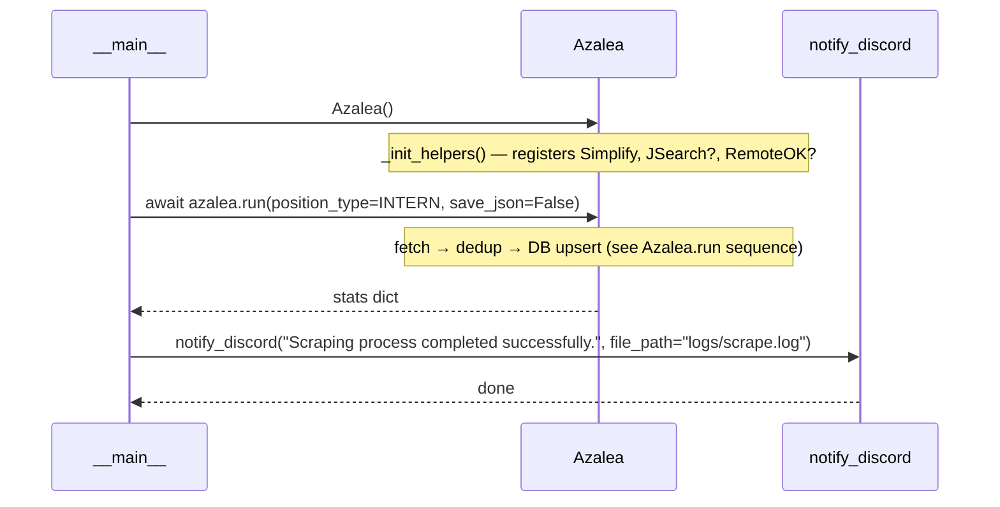

```mermaid
%% sequenceDiagram — Tasks/scrape.py main() (entry point)
sequenceDiagram
    participant Entry as __main__
    participant Az as Azalea
    participant Discord as notify_discord

    Entry->>Az: Azalea()
    Note over Az: _init_helpers() — registers Simplify, JSearch?, RemoteOK?

    Entry->>Az: await azalea.run(position_type=INTERN, save_json=False)
    Note over Az: fetch → dedup → DB upsert (see Azalea.run sequence)
    Az-->>Entry: stats dict

    Entry->>Discord: notify_discord("Scraping process completed successfully.", file_path="logs/scrape.log")
    Discord-->>Entry: done

```