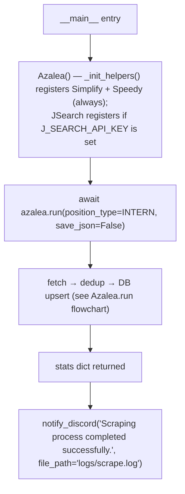

```mermaid
%% flowchart — Tasks/scrape.py main() (entry point)
flowchart TD
    A["__main__ entry"] --> B["Azalea() — _init_helpers() registers Simplify + Speedy (always);<br/>JSearch registers if J_SEARCH_API_KEY is set"]
    B --> C["await azalea.run(position_type=INTERN, save_json=False)"]
    C --> D["fetch → dedup → DB upsert (see Azalea.run flowchart)"]
    D --> E[stats dict returned]
    E --> F["notify_discord('Scraping process completed successfully.', file_path='logs/scrape.log')"]
```
