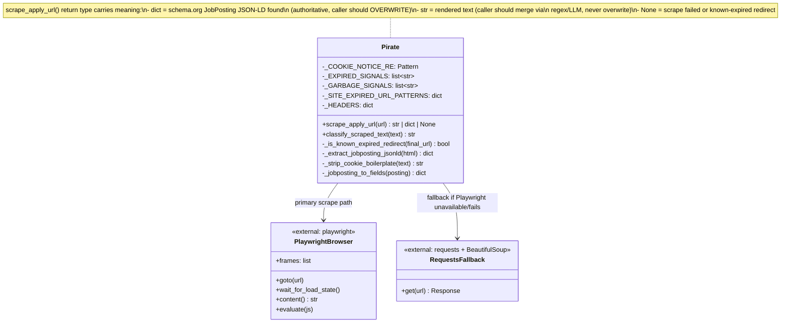

```mermaid
%% classDiagram — Pirate (Service/Scrapper.py) - new module, no prior diagram
classDiagram
    class Pirate {
        -_COOKIE_NOTICE_RE: Pattern
        -_EXPIRED_SIGNALS: list~str~
        -_GARBAGE_SIGNALS: list~str~
        -_SITE_EXPIRED_URL_PATTERNS: dict
        -_HEADERS: dict
        +scrape_apply_url(url) str | dict | None
        +classify_scraped_text(text) str
        -_is_known_expired_redirect(final_url) bool
        -_extract_jobposting_jsonld(html) dict
        -_strip_cookie_boilerplate(text) str
        -_jobposting_to_fields(posting) dict
    }

    class PlaywrightBrowser {
        <<external: playwright>>
        +goto(url)
        +wait_for_load_state()
        +content() str
        +frames: list
        +evaluate(js)
    }

    class RequestsFallback {
        <<external: requests + BeautifulSoup>>
        +get(url) Response
    }

    Pirate --> PlaywrightBrowser : primary scrape path
    Pirate --> RequestsFallback : fallback if Playwright unavailable/fails

    note for Pirate "scrape_apply_url() return type carries meaning:\n- dict = schema.org JobPosting JSON-LD found\n  (authoritative, caller should OVERWRITE)\n- str = rendered text (caller should merge via\n  regex/LLM, never overwrite)\n- None = scrape failed or known-expired redirect"
```
