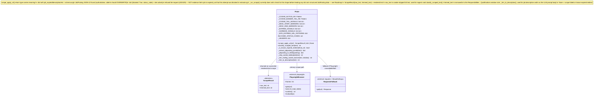

```mermaid
%% classDiagram — Pirate (Service/Scrapper.py)
classDiagram
    class ScrapeResult {
        <<dataclass>>
        +raw_text: str
        +trimmed_text: str
    }

    class Pirate {
        -_COOKIE_NOTICE_RE: Pattern
        -_COOKIE_BANNER_TAIL_RE: Pattern
        -_COOKIE_TAIL_SIGNALS: list~str~
        -_DESC_START_MARKERS: list~str~
        -_DESC_END_MARKERS: list~str~
        -_EXPIRED_SIGNALS: list~str~
        -_GARBAGE_SIGNALS: list~str~
        -_SITE_EXPIRED_URL_PATTERNS: dict
        -BLOCKED_STATUS_CODES: set 
        -_HEADERS: dict
        +scrape_apply_url(url) ScrapeResult | dict | None
        +classify_scraped_text(text) str
        -_is_known_expired_redirect(final_url) bool
        -_extract_jobposting_jsonld(html) dict
        -_jobposting_to_fields(posting) dict
        -_strip_cookie_boilerplate(text) str
        -_trim_trailing_cookie_banner(text, window) str
        -_trim_to_description(text) str
    }

    class PlaywrightBrowser {
        <<external: playwright>>
        +goto(url)
        +wait_for_load_state()
        +content() str
        +frames: list
        +evaluate(js)
    }

    class RequestsFallback {
        <<external: requests + BeautifulSoup>>
        +get(url) Response
    }

    Pirate --> ScrapeResult : returned on successful rendered-text scrape
    Pirate --> PlaywrightBrowser : primary scrape path
    Pirate --> RequestsFallback : fallback if Playwright unavailable/fails

    note for Pirate "scrape_apply_url() return type carries meaning:\n- dict with job_expired/description/etc = schema.org\n  JobPosting JSON-LD found (authoritative, caller\n  should OVERWRITE)\n- dict {blocked: True, status_code} = site actively\n  refused the request (403/429) — NOT evidence the\n  job is expired, just that this attempt was blocked.\n  extractor.py's _run_scrape() currently does not\n  check for this shape before treating any dict as\n  structured JobPosting data — see Roadmap.\n- ScrapeResult(raw_text, trimmed_text) = rendered text.\n  raw_text is cookie-stripped full text, used for regex\n  and classify_scraped_text(). trimmed_text is narrowed\n  to the Responsibilities→Qualifications window via\n  _trim_to_description(), used for job.description and\n  as the LLM prompt body.\n- None = scrape failed or known-expired redirect"
```