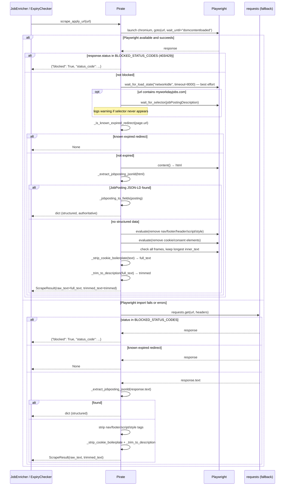
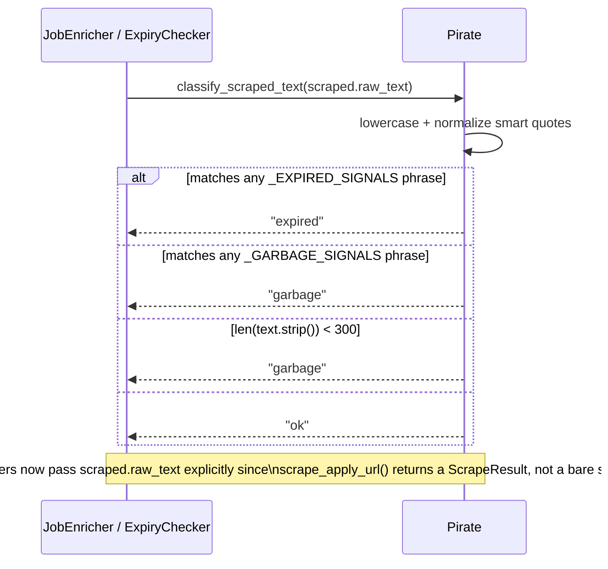

```mermaid
%% sequenceDiagram — Pirate.scrape_apply_url() full decision path
sequenceDiagram
    participant Caller as JobEnricher / ExpiryChecker
    participant P as Pirate
    participant PW as Playwright
    participant Req as requests (fallback)

    Caller->>P: scrape_apply_url(url)

    P->>PW: launch chromium, goto(url, wait_until="domcontentloaded")
    alt Playwright available and succeeds
        PW-->>P: response

        alt response.status in BLOCKED_STATUS_CODES (403/429)
            P-->>Caller: {"blocked": True, "status_code": ...}
        else not blocked
            P->>PW: wait_for_load_state("networkidle", timeout=8000) — best effort

            opt url contains myworkdayjobs.com
                P->>PW: wait_for_selector(jobPostingDescription)
                Note over P: logs warning if selector never appears
            end

            P->>P: _is_known_expired_redirect(page.url)
            alt known expired redirect
                P-->>Caller: None
            else not expired
                P->>PW: content() → html
                P->>P: _extract_jobposting_jsonld(html)

                alt JobPosting JSON-LD found
                    P->>P: _jobposting_to_fields(posting)
                    P-->>Caller: dict (structured, authoritative)
                else no structured data
                    P->>PW: evaluate(remove nav/footer/header/script/style)
                    P->>PW: evaluate(remove cookie/consent elements)
                    P->>PW: check all frames, keep longest inner_text
                    P->>P: _strip_cookie_boilerplate(text) → full_text
                    P->>P: _trim_to_description(full_text) → trimmed
                    P-->>Caller: ScrapeResult(raw_text=full_text, trimmed_text=trimmed)
                end
            end
        end
    else Playwright import fails or errors
        P->>Req: requests.get(url, headers)
        alt status in BLOCKED_STATUS_CODES
            Req-->>P: response
            P-->>Caller: {"blocked": True, "status_code": ...}
        else known expired redirect
            Req-->>P: response
            P-->>Caller: None
        else
            Req-->>P: response.text
            P->>P: _extract_jobposting_jsonld(response.text)
            alt found
                P-->>Caller: dict (structured)
            else
                P->>P: strip nav/footer/script/style tags
                P->>P: _strip_cookie_boilerplate + _trim_to_description
                P-->>Caller: ScrapeResult(raw_text, trimmed_text)
            end
        end
    end
```

```mermaid
%% sequenceDiagram — Pirate.classify_scraped_text()
sequenceDiagram
    participant Caller as JobEnricher / ExpiryChecker
    participant P as Pirate

    Caller->>P: classify_scraped_text(scraped.raw_text)
    P->>P: lowercase + normalize smart quotes

    alt matches any _EXPIRED_SIGNALS phrase
        P-->>Caller: "expired"
    else matches any _GARBAGE_SIGNALS phrase
        P-->>Caller: "garbage"
    else len(text.strip()) < 300
        P-->>Caller: "garbage"
    else
        P-->>Caller: "ok"
    end

    Note over Caller,P: Callers now pass scraped.raw_text explicitly since\nscrape_apply_url() returns a ScrapeResult, not a bare str.
```