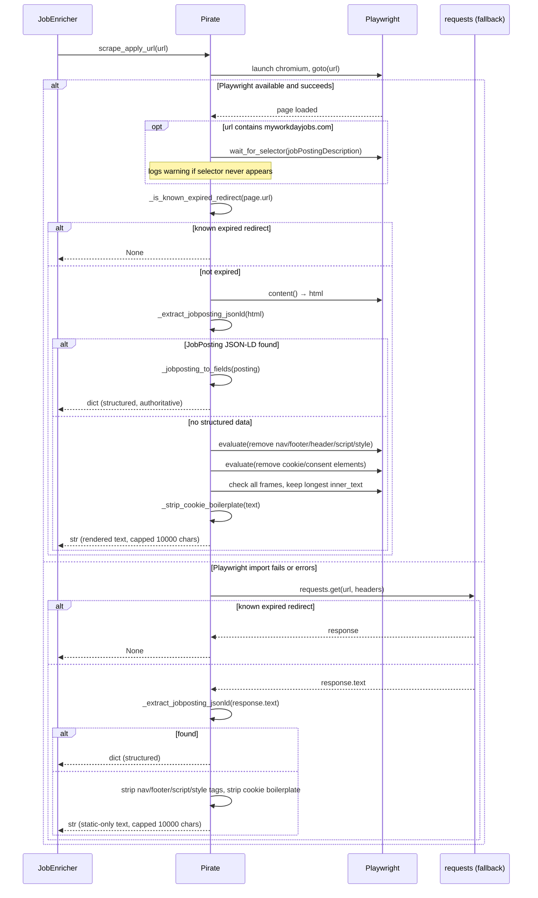
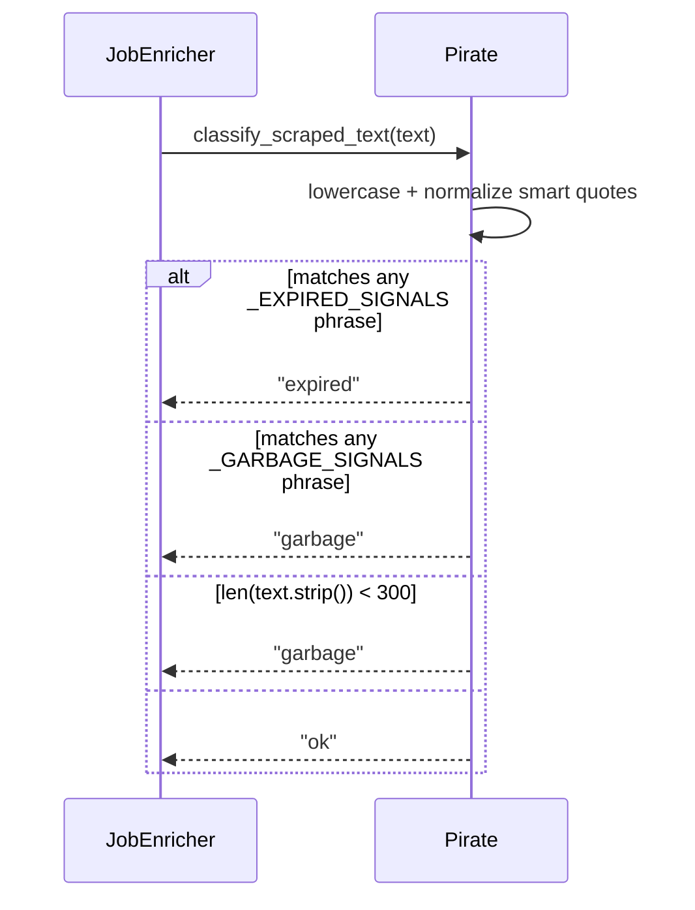

```mermaid
%% sequenceDiagram — Pirate.scrape_apply_url() full decision path
sequenceDiagram
    participant Caller as JobEnricher
    participant P as Pirate
    participant PW as Playwright
    participant Req as requests (fallback)

    Caller->>P: scrape_apply_url(url)

    P->>PW: launch chromium, goto(url)
    alt Playwright available and succeeds
        PW-->>P: page loaded

        opt url contains myworkdayjobs.com
            P->>PW: wait_for_selector(jobPostingDescription)
            Note over P: logs warning if selector never appears
        end

        P->>P: _is_known_expired_redirect(page.url)
        alt known expired redirect
            P-->>Caller: None
        else not expired
            P->>PW: content() → html
            P->>P: _extract_jobposting_jsonld(html)

            alt JobPosting JSON-LD found
                P->>P: _jobposting_to_fields(posting)
                P-->>Caller: dict (structured, authoritative)
            else no structured data
                P->>PW: evaluate(remove nav/footer/header/script/style)
                P->>PW: evaluate(remove cookie/consent elements)
                P->>PW: check all frames, keep longest inner_text
                P->>P: _strip_cookie_boilerplate(text)
                P-->>Caller: str (rendered text, capped 10000 chars)
            end
        end
    else Playwright import fails or errors
        P->>Req: requests.get(url, headers)
        alt known expired redirect
            Req-->>P: response
            P-->>Caller: None
        else
            Req-->>P: response.text
            P->>P: _extract_jobposting_jsonld(response.text)
            alt found
                P-->>Caller: dict (structured)
            else
                P->>P: strip nav/footer/script/style tags, strip cookie boilerplate
                P-->>Caller: str (static-only text, capped 10000 chars)
            end
        end
    end
```

```mermaid
%% sequenceDiagram — Pirate.classify_scraped_text()
sequenceDiagram
    participant Caller as JobEnricher
    participant P as Pirate

    Caller->>P: classify_scraped_text(text)
    P->>P: lowercase + normalize smart quotes

    alt matches any _EXPIRED_SIGNALS phrase
        P-->>Caller: "expired"
    else matches any _GARBAGE_SIGNALS phrase
        P-->>Caller: "garbage"
    else len(text.strip()) < 300
        P-->>Caller: "garbage"
    else
        P-->>Caller: "ok"
    end
```
