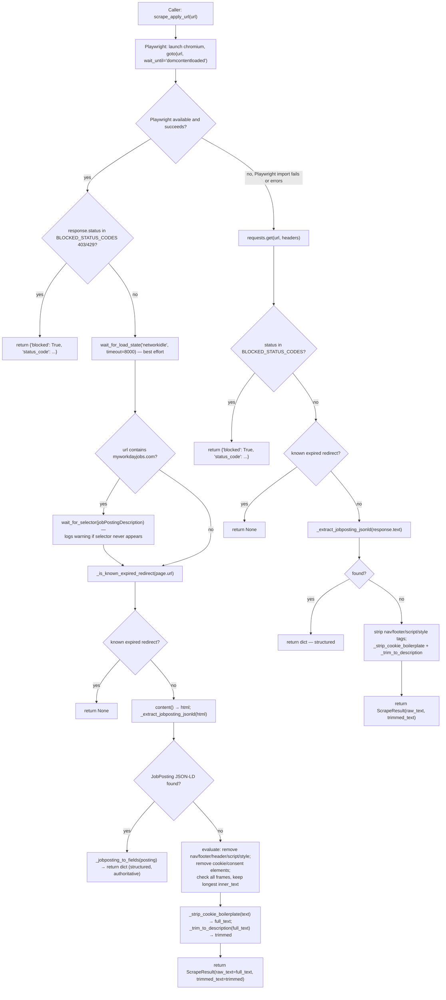
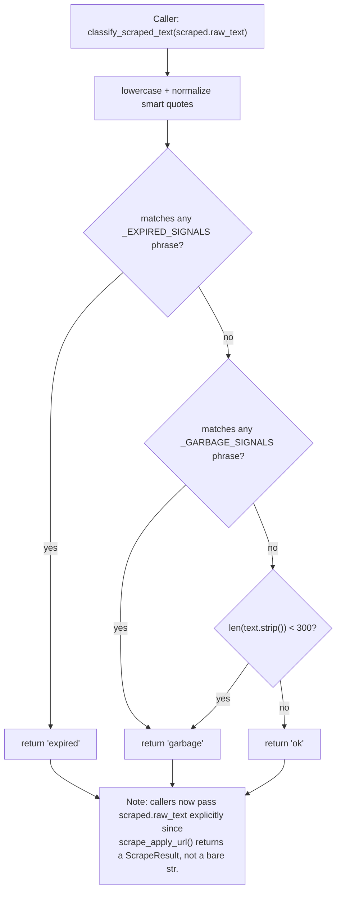

```mermaid
%% flowchart — Pirate.scrape_apply_url() full decision path
flowchart TD
    A["Caller: scrape_apply_url(url)"] --> B["Playwright: launch chromium, goto(url, wait_until='domcontentloaded')"]
    B --> C{Playwright available and succeeds?}
    C -->|yes| D{response.status in BLOCKED_STATUS_CODES 403/429?}
    D -->|yes| E["return {'blocked': True, 'status_code': ...}"]
    D -->|no| F["wait_for_load_state('networkidle', timeout=8000) — best effort"]
    F --> G{url contains myworkdayjobs.com?}
    G -->|yes| H["wait_for_selector(jobPostingDescription) —<br/>logs warning if selector never appears"]
    G -->|no| I["_is_known_expired_redirect(page.url)"]
    H --> I
    I --> J{known expired redirect?}
    J -->|yes| K[return None]
    J -->|no| L["content() → html; _extract_jobposting_jsonld(html)"]
    L --> M{JobPosting JSON-LD found?}
    M -->|yes| N["_jobposting_to_fields(posting) → return dict (structured, authoritative)"]
    M -->|no| O["evaluate: remove nav/footer/header/script/style;<br/>remove cookie/consent elements;<br/>check all frames, keep longest inner_text"]
    O --> P["_strip_cookie_boilerplate(text) → full_text;<br/>_trim_to_description(full_text) → trimmed"]
    P --> Q["return ScrapeResult(raw_text=full_text, trimmed_text=trimmed)"]
    C -->|no, Playwright import fails or errors| R["requests.get(url, headers)"]
    R --> S{status in BLOCKED_STATUS_CODES?}
    S -->|yes| T["return {'blocked': True, 'status_code': ...}"]
    S -->|no| U{known expired redirect?}
    U -->|yes| V[return None]
    U -->|no| W["_extract_jobposting_jsonld(response.text)"]
    W --> X{found?}
    X -->|yes| Y[return dict — structured]
    X -->|no| Z["strip nav/footer/script/style tags;<br/>_strip_cookie_boilerplate + _trim_to_description"]
    Z --> AA["return ScrapeResult(raw_text, trimmed_text)"]
```

```mermaid
%% flowchart — Pirate.classify_scraped_text()
flowchart TD
    A["Caller: classify_scraped_text(scraped.raw_text)"] --> B["lowercase + normalize smart quotes"]
    B --> C{matches any _EXPIRED_SIGNALS phrase?}
    C -->|yes| D["return 'expired'"]
    C -->|no| E{matches any _GARBAGE_SIGNALS phrase?}
    E -->|yes| F["return 'garbage'"]
    E -->|no| G{"len(text.strip()) < 300?"}
    G -->|yes| F
    G -->|no| H["return 'ok'"]
    D --> I["Note: callers now pass scraped.raw_text explicitly since<br/>scrape_apply_url() returns a ScrapeResult, not a bare str."]
    F --> I
    H --> I
```
